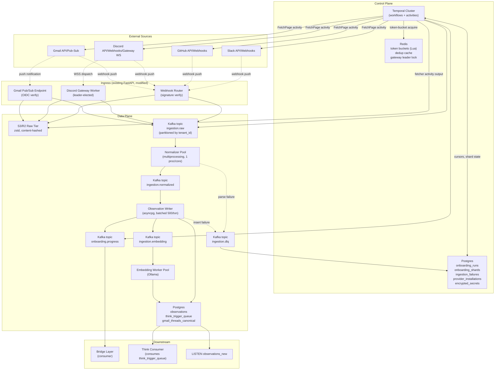
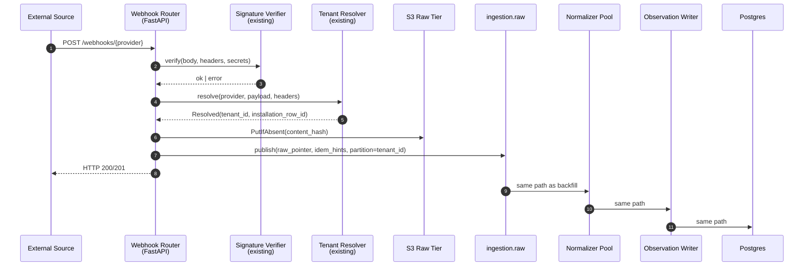
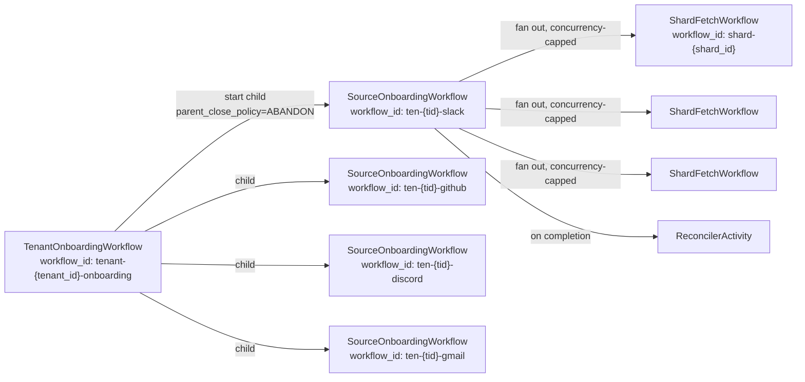
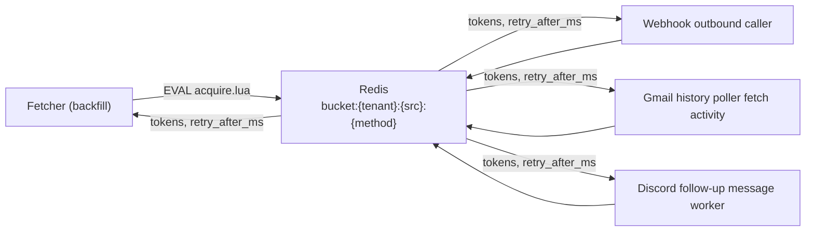

# Fyralis Ingestion — High-Level Design

**Scope:** Production-grade backfill ingestion pipeline for Slack, GitHub, Discord, Gmail. Adopts the Temporal + Kafka + S3 + Redis stack mandated by the brief. Designed for full-history backfill with a recency-first "feels onboarded" moment in ≤15 minutes, plus steady-state webhook/gateway ingestion converged onto the same data plane. Brownfield: existing handlers, OAuth substrate, and observation schema are preserved; everything else around them is reshaped.

This document answers **why this shape?** Implementation specifics (DDL, activity step-by-step, code shapes) live in `03-low-level-design.md`.

---

## Goals & Non-Goals

### Goals

1. **Backfill-on-install for all four sources.** A newly connected tenant sees recency-prioritised data populating within ≤15 minutes; total backfill completes within 4–8 hours for a typical mid-size tenant; reconciliation confirms coverage ≥99.9% against source-side counts.
2. **Crash-recoverable end-to-end.** Any worker (planner, fetcher, normalizer, writer, embedder) can be killed and restarted without data loss or duplicate observations. Cursors only advance after data is durably persisted.
3. **Replayable from raw.** Every API response and every webhook payload is content-hash-keyed into S3/R2 before any transformation. Re-running normalization on stored raw produces identical observations without re-hitting any source.
4. **Per-tenant fault isolation.** A pathological tenant cannot exhaust rate budget, queue capacity, normalizer CPU, or DB connections for other tenants.
5. **Unified ingestion plane.** Webhook events, Gateway-streamed events, and backfill-fetched events all converge on a single `ingestion.raw` Kafka topic; one normalizer pool processes all three.

### Non-Goals (this design deliberately excludes)

1. **Multi-region active-active.** Single-region; cross-region DR is a Phase-5 concern after we are operationally fluent with this stack.
2. **Schema registry (Avro/Protobuf).** Pydantic v2 models in-repo are the schema; Kafka topics carry JSON; evolution is additive-field-only with a documented compatibility contract.
3. **Custom backpressure protocol.** Kafka consumer-group lag + Temporal task-queue depth are the signals; no application-layer flow control.
4. **Bridge Layer table design.** Per the Phase 1 review, Bridge is greenfield and out of scope. This design names the integration surface (the `onboarding.progress` topic) and stops there.
5. **Workflow versioning beyond Temporal's built-in mechanisms.** Patched workflows use Temporal's `patched()` / `default_version_for_command()`; we do not roll our own.

---

## Architecture Overview



**Two planes, four layers.**

The **control plane** is Temporal + Postgres metadata + Redis. Temporal owns workflow orchestration and activity scheduling. Postgres holds durable workflow-adjacent state (cursor positions, shard manifests, failure history) plus the existing OAuth substrate. Redis holds ephemeral coordination state: token buckets (one per `(tenant, source, method)`), short-window dedup hints, and the Discord Gateway leader lock.

The **data plane** is S3 + Kafka + worker pools + Postgres `observations`. Raw payloads land in S3 first, then a pointer + idempotency hints publish to `ingestion.raw`. The normalizer pool consumes raw and produces shaped `ObservationDraft` JSON on `ingestion.normalized`. The observation writer consumes normalized and runs the existing `ingest()` core path's persist phase (handler dispatch was already done in normalizer; actor resolve + entity extract + INSERT + T1-trigger enqueue remain). The embedding worker is decoupled onto `ingestion.embedding`.

The **ingress layer** keeps the existing FastAPI webhook router and Gmail Pub/Sub endpoint, but their write target changes: instead of calling `ingest()` inline, they signature-verify, write raw to S3, and publish to `ingestion.raw`. The Discord Gateway worker becomes leader-elected (Redis lock); its received `MESSAGE_CREATE` frames write to the same raw tier and topic as webhooks.

The **downstream layer** is unchanged in shape: existing `NOTIFY observations_new`, existing `think_trigger_queue`, plus a new `onboarding.progress` topic that the Bridge Layer subscribes to.

**The key structural decision:** webhooks and backfill converge at `ingestion.raw`. The normalizer pool, observation writer, and embedding worker do not know or care whether a given message arrived via a real-time push or a historical fetch. This is what lets us reuse 100% of the existing handler logic and observation-insert path while adding a backfill workflow tree above them.

---

## Component Inventory

| Component | Responsibility | Tech | Scales with |
|---|---|---|---|
| `TenantOnboardingWorkflow` | Orchestrate per-tenant install: fan out to all enabled sources, emit `tenant.onboarding.started` and `…complete` progress events | Temporal Python SDK | # tenants installing concurrently |
| `SourceOnboardingWorkflow` | Per (tenant, source): run planner, spawn `ShardFetchWorkflow` children, run reconciler, emit `source.onboarding.feels_onboarded` and `…complete` | Temporal | # active source installs |
| `ShardFetchWorkflow` | Drive one shard from start cursor → done; sequence FetchPage / PersistRaw / Publish / AdvanceCursor activities | Temporal | # in-flight shards (concurrency-capped per tenant) |
| Source planners (`slack`, `github`, `discord`, `gmail`) | Discover shards from source state (channels / repos / mailboxes / guild channels), assign recency score, write `onboarding_shards` rows | Python coroutines invoked as Temporal activities | source state size (one-shot at workflow start) |
| Fetcher activities (per source) | Single API call → return (page_body, next_cursor, retry_after_hint) | aiohttp/httpx, called inside Temporal activity | rate-bucket headroom + source RPS |
| Rate limiter | Token-bucket per `(tenant, source, method)`, Lua-scripted atomic acquire-or-deny, honors `Retry-After` | Redis 7 + Lua | # buckets ≈ #tenants × #sources × #methods |
| Raw tier | Store every API response and webhook body as zstd-compressed JSON, keyed by content hash | S3 / R2 (S3-compatible) | total inbound bytes; 90-day retention default |
| `ingestion.raw` topic | Unified inbound queue: backfill pages, webhook bodies, gateway frames, Pub/Sub-triggered fetches | Kafka (confluent-kafka-python producer; aiokafka consumer) | partition count = ceil(peak msgs/sec / per-consumer throughput) |
| Normalizer pool | Decompress raw, dispatch through existing handler registry → `ObservationDraft` JSON | Python `multiprocessing` (1 proc/core), orjson, Pydantic v2 | # cores per pod × # pods |
| `ingestion.normalized` topic | Shaped drafts ready for DB insert, keyed by `tenant_id` for partition affinity | Kafka | normalized throughput (≈1.1× raw msg count) |
| Observation writer | Consume normalized, batch INSERT into `observations`, atomically enqueue `think_trigger_queue`, publish to `ingestion.embedding` | aiokafka + asyncpg (batched 500/txn) | DB write throughput |
| Embedding worker | Consume `ingestion.embedding`, call Ollama, UPDATE `observations.embedding`, flip `embedding_pending=FALSE` | aiokafka + httpx → Ollama | Ollama parallelism × # workers |
| Reconciler activity (per source) | At source onboarding completion: re-query authoritative count APIs, identify coverage gaps >0.1%, write new `onboarding_shards` rows tagged `reconciliation_resharded` | Temporal activity | # source installs completing |
| Webhook ingress | Existing FastAPI router; modified to write raw → S3 → publish to `ingestion.raw` instead of inline `ingest()` | FastAPI + uvicorn (existing) | inbound webhook RPS |
| Discord Gateway worker | Long-running WSS connection; persists `session_id` + `seq` to Postgres on every dispatched frame; leader-elected via Redis lease | `websockets` (existing) + Redis lock | 1 active worker per app (sharding deferred) |
| Bridge progress emitter | Publish `onboarding.progress` events for tenant/source lifecycle milestones | Temporal activity calls from workflows | # workflow state transitions |
| DLQ | `ingestion.dlq` Kafka topic + Postgres `ingestion_failures` mirror for ops queries | Kafka + Postgres | # parse / insert failures |

---

## Data Flow

### Backfill flow (Tenant install → first observation)

```mermaid
sequenceDiagram
    autonumber
    participant UI as Install UI
    participant OAuth as OAuth Callback<br/>(existing)
    participant TMP as Temporal
    participant Plan as Source Planner
    participant SFW as ShardFetchWorkflow
    participant Rate as Redis Rate Bucket
    participant Src as External Source
    participant S3 as S3 Raw Tier
    participant KRaw as ingestion.raw
    participant Norm as Normalizer Pool
    participant KNrm as ingestion.normalized
    participant Wr as Observation Writer
    participant DB as Postgres observations
    participant KProg as onboarding.progress
    participant Br as Bridge Layer

    UI->>OAuth: install completes
    OAuth->>TMP: start TenantOnboardingWorkflow(tenant_id)
    TMP->>KProg: tenant.onboarding.started
    KProg->>Br: subscribe

    TMP->>TMP: spawn SourceOnboardingWorkflow per source
    TMP->>Plan: discover_shards(tenant, source)
    Plan->>Src: list channels/repos/mailboxes
    Plan-->>TMP: shard manifest (recency-scored)
    TMP->>DB: INSERT onboarding_shards rows

    loop For each shard (high-recency first)
        TMP->>SFW: start ShardFetchWorkflow(shard_id)
        loop Until shard cursor exhausted
            SFW->>Rate: acquire token(tenant, source, method)
            Rate-->>SFW: granted | retry_after_ms
            SFW->>Src: API call with cursor
            Src-->>SFW: page body + next_cursor
            SFW->>S3: PutIfAbsent(content_hash)
            SFW->>KRaw: publish(raw_pointer, idem_hints, partition=tenant_id)
            SFW->>DB: AdvanceCursor activity (separate txn)
        end
        SFW-->>TMP: shard_done
    end

    KRaw->>Norm: consume
    Norm->>Norm: dispatch handler → ObservationDraft
    Norm->>KNrm: publish(draft, partition=tenant_id)

    KNrm->>Wr: consume in batches of ~500
    Wr->>DB: BEGIN; INSERT observations; INSERT think_trigger_queue; COMMIT
    Wr->>KProg: shard.fetched (when shard's normalized rows are written)

    Note over TMP,KProg: When 80% of recency-bucket-0 shards complete<br/>OR 15 min elapses:
    TMP->>KProg: source.onboarding.feels_onboarded
```

**Narrative:** OAuth completion (existing code, unchanged) triggers a Temporal `TenantOnboardingWorkflow`. That workflow fans out per enabled source. Each `SourceOnboardingWorkflow` calls its planner — a source-specific activity that enumerates the work units (Slack channels, GitHub repos, Gmail mailboxes, Discord channels per guild) and produces a recency-scored shard manifest, persisted to `onboarding_shards`.

The workflow then spawns `ShardFetchWorkflow` children with concurrency capped per (tenant, source) via Temporal semaphores. Each shard workflow runs an inner loop: acquire a rate token from Redis (blocking on `Retry-After` if denied), call the source API, write the raw response to S3 with content-hash keying (PutIfAbsent — duplicate writes are a no-op storage cost), publish a tiny pointer + idempotency hint envelope to `ingestion.raw`, and then advance the shard's cursor in a **separate** Postgres transaction. The separation matters: if the workflow worker crashes between the Kafka publish and the cursor advance, the next retry re-fetches the same page, S3 PutIfAbsent is a no-op, Kafka receives a duplicate envelope, and the normalizer's idempotency key (built from source-stable IDs) ensures zero duplicate observations.

The normalizer pool consumes raw envelopes, pulls the body from S3, dispatches through the existing handler registry to produce `ObservationDraft` JSON, and publishes to `ingestion.normalized` keyed by `tenant_id` (ensures ordering per tenant; cross-tenant work parallelises). The observation writer consumes batches and runs the existing `ingest()` persist path: actor resolve, entity extract, atomic INSERT + `think_trigger_queue` enqueue, post-commit `NOTIFY observations_new`. The embedding worker is decoupled — it consumes a separate topic populated by the writer, calls Ollama, UPDATEs the row, and flips `embedding_pending=FALSE`.

The Bridge Layer subscribes to `onboarding.progress`. The "feels onboarded" event fires when either 80% of the highest-recency bucket has completed OR 15 minutes have elapsed since `tenant.onboarding.started`, whichever first.

### Steady-state flow (Webhook arrival → observation)



**Narrative:** Identical from `ingestion.raw` onward. The webhook router still does the security work (signature verification, replay-cache check for GitHub, tenant resolution) but stops short of calling `ingest()` synchronously. The HTTP 200 acknowledgment is returned as soon as the raw payload is durable in S3 and the Kafka publish has succeeded. End-to-end p95 (webhook arrival to observation row visible) targets ≤5 seconds; the existing 1.5 s inline target is replaced by a 1.5 s ingress-only target (S3 PutIfAbsent + Kafka publish) plus a separate 2–3 s normalizer-pool processing budget.

The Discord Gateway worker follows the same path: each `MESSAGE_CREATE` frame is written to S3 (keyed by `message.id`-based content hash to be safe under retransmission), envelope published to `ingestion.raw`. The Gmail Pub/Sub endpoint triggers a small Temporal activity (`HistoryDrainActivity`) that runs `users.history.list` and publishes each returned message ID's fetch result into `ingestion.raw`, reusing the same machinery as backfill.

### Workflow tree (Temporal)



`PARENT_CLOSE_POLICY=ABANDON` on the source-level children means a tenant-workflow restart does not cancel in-flight source backfills. Workflow IDs include `tenant_id` so concurrent installs are trivially isolated and Temporal's per-workflow-id mutex serializes restarts.

---

## Cross-Cutting Decisions

### Idempotency

**Decision:** Preserve the existing source-native identifier choices verbatim. The current codebase already has the right keys; backfill must use the *same* keys so that an event delivered via webhook and the same event later re-fetched by reconciliation produce one observation, not two.

| Source | external_id formula | Source identifier semantics |
|---|---|---|
| Slack | `slack:{channel_id}:{event.ts}` | Slack's `ts` is a microsecond-precise per-channel timestamp string ("1234567890.123456") generated server-side; it is the canonical message identifier and survives edits (the `edited` envelope adds a separate `edited.ts` but the message's own `ts` does not change). Per Slack API docs and current code at [handlers/slack.py:207](services/ingestion/handlers/slack.py#L207). |
| GitHub | `github:{node_id}` for object events; `github:{repo}@{after}` for push | `node_id` is GitHub's GraphQL global identifier — base64-encoded, schema-versioned, globally unique across orgs. For push events the `after` SHA is commit-immutable and `(repo, sha)` is unique. Per current code at [handlers/github.py:216, 256, 304, 352, 415, 461](services/ingestion/handlers/github.py#L216). |
| Discord (interaction) | `discord:interaction:{interaction.id}` | Snowflake (64-bit: timestamp\|worker\|process\|increment). Discord's `id` field is canonical and never reused. Current code at [handlers/discord.py:151-155](services/ingestion/handlers/discord.py#L151-L155). |
| Discord (message) | `discord:message:{message.id}` | Same snowflake semantics. Current code at [handlers/discord.py:269](services/ingestion/handlers/discord.py#L269). |
| Gmail | `gmail:{install_id}:{rfc5322_message_id}` | RFC 5322 §3.6.4: "The Message-ID field provides a unique message identifier that refers to a particular version of a particular message" — globally unique across mailboxes, generated by the originating MTA, survives Gmail's internal `id` churn (label moves, archive/unarchive). Current code at [handlers/gmail.py:180-184, 235](services/ingestion/handlers/gmail.py#L180-L184). |

The `{install_id}` prefix on Gmail scopes the dedup to one Fyralis-managed install — important when one Fyralis instance manages multiple distinct OAuth installs for the same domain (rare but possible during reinstall cycles). Slack/GitHub/Discord do not need the prefix because their identifier spaces are globally unique.

**Backfill-specific concern:** the GitHub `search/issues` API returns issues and PRs that the webhook stream would also deliver. Both produce identical `node_id` external IDs. The observation `UNIQUE(source_channel, external_id, occurred_at)` index drops the second write. The Slack `conversations.history` API returns messages with the same `(channel_id, ts)` pair as the webhook stream — same UNIQUE catches it. No special "is this a backfill or a webhook?" branching is required anywhere downstream.

**Where the existing UNIQUE constraint is wrong:** including `occurred_at` in the unique key means an event whose `occurred_at` changes between two arrivals (theoretical; not observed in any source) would double-insert. The LLD will propose tightening to `UNIQUE(tenant_id, source_channel, external_id)` and adding `tenant_id` to the dedup key — currently the index is global per `source_channel`, which works only because the source-native IDs are themselves globally unique. With `(install_id)` prefixing now standard, the `tenant_id` column is the cleaner scoping; the migration is additive (build new index concurrently, drop old).

### Rate Limiting

**Decision:** Single Redis-resident Lua-scripted token bucket per `(tenant_id, source, method)`, honored by every outbound call from any worker, including backfill fetchers and existing OAuth-callback-time API calls. No per-process counters, no in-memory backoff. The current per-integration ad-hoc 429 retry code is deleted.

**Topology:**



**Lua script (sketch — full version in LLD):**

```lua
-- KEYS[1] = bucket key
-- ARGV[1] = now_ms, ARGV[2] = capacity, ARGV[3] = refill_per_sec, ARGV[4] = cost
-- returns: {granted (0/1), tokens_remaining, retry_after_ms}
local bucket = redis.call('HMGET', KEYS[1], 'tokens', 'updated_at')
local tokens = tonumber(bucket[1]) or tonumber(ARGV[2])
local updated_at = tonumber(bucket[2]) or tonumber(ARGV[1])
local elapsed = tonumber(ARGV[1]) - updated_at
tokens = math.min(tonumber(ARGV[2]), tokens + elapsed * tonumber(ARGV[3]) / 1000)
local cost = tonumber(ARGV[4])
if tokens >= cost then
  tokens = tokens - cost
  redis.call('HMSET', KEYS[1], 'tokens', tokens, 'updated_at', ARGV[1])
  redis.call('PEXPIRE', KEYS[1], 86400000)
  return {1, tokens, 0}
end
local retry_after_ms = math.ceil((cost - tokens) * 1000 / tonumber(ARGV[3]))
return {0, tokens, retry_after_ms}
```

**Retry-After handling:** When a source returns 429 with a `Retry-After` header, the fetcher activity (a) reports the discovered duration back into the bucket as a "lockout" (next acquire is denied for at least `Retry-After` regardless of token math) via a small second Lua script, and (b) raises `RateLimited(retry_after_ms)` which Temporal converts into a workflow-side `await asyncio.sleep(retry_after_ms)` before retrying the activity. This means the source's hint dominates our token math — we never thrash by hammering an exhausted budget.

**Bucket sizing:** Per-source defaults (Slack Tier 3 = 50/min/method, GitHub authenticated REST = 5000/hour, Gmail = 250 quota units/user/sec, Discord = per-bucket dynamic), bucketed at 80% of source limit to leave headroom. Per-tenant overrides allowed for paying-tier customers. Bucket counters are sharded across Redis cluster nodes via `(tenant_id, source)` hash tags — same tenant always lands on same shard.

### Raw Tier

**Decision:** Every inbound byte (webhook body, gateway frame body, API response body) lands in S3/R2 before any transformation. Reprocessing reads from S3, never from sources. This is the single most important capability change vs. today.

**Object key scheme:**

```
s3://fyralis-raw/{env}/{source}/{tenant_id}/{yyyy-mm}/{content_hash[:2]}/{content_hash}.json.zst
```

- `{env}` ∈ {`prod`, `staging`, `dev`}; enables single-bucket multi-env.
- `{source}` ∈ {`slack`, `github`, `discord`, `gmail`}; one prefix per source for IAM and lifecycle policies.
- `{tenant_id}` UUID; enables per-tenant Delete-On-Uninstall via prefix delete.
- `{yyyy-mm}` enables S3 lifecycle rules (e.g., Standard → Glacier after 90 days).
- `{content_hash[:2]}` 2-char prefix shard to spread load across S3 partitions.
- `{content_hash}` = blake2b-160 hex of the raw body bytes. Stable identifier; PutIfAbsent semantics by writing with `If-None-Match: *`.

**Compression:** zstd level 3 by default (single-digit ms encode at ~10 KB/page; ~5–10× ratio for JSON). Compression decision per source-class — Gmail message bodies don't double-compress (already MIME-encoded) but headers do.

**Retention:** 90 days for backfill raw (replayable for reconciliation rerun); 30 days for steady-state raw (replayable for normalizer bug fixes). Both configurable per-tenant for higher-tier customers (think customers with compliance hold needs). Lifecycle rules in S3 handle expiry; no application code involved.

**`ingestion.raw` envelope shape** (the Kafka message body, not the S3 body):

```json
{
  "envelope_version": 1,
  "source": "github",
  "tenant_id": "uuid",
  "raw_s3_key": "s3://...",
  "content_hash": "blake2b-160",
  "ingested_at": "2026-05-17T...",
  "ingress_kind": "webhook|gateway|pubsub|backfill",
  "ingress_metadata": {
    "delivery_id": "X-GitHub-Delivery value",
    "event_type": "pull_request",
    "shard_id": "uuid-or-null",
    "cursor_token": "next-cursor-when-backfill"
  },
  "idem_hints": {
    "expected_external_id_prefix": "github:",
    "expected_source_channel": "github:webhook"
  }
}
```

Envelopes are bounded (~1–4 KB); bodies are pointer-only. This keeps Kafka throughput dominated by message count, not byte count, and lets us scale partitions on message-rate independent of payload size.

### Failure Isolation

**Per-tenant isolation mechanisms:**

1. **Kafka partition affinity.** All `ingestion.*` topics are partitioned by `tenant_id`. A noisy tenant's messages queue up behind their own partition's consumer; other tenants' partitions process independently. Partition count = 64 default (multi-pod consumer parallelism); scale to 256 if heavy tenants concentrate on too few partitions.
2. **Per-tenant Redis token buckets.** Per "Rate Limiting" above. A tenant who exhausts their bucket cannot dilute other tenants' headroom.
3. **Temporal task queue per source, not per tenant.** Workflow IDs include `tenant_id` so Temporal serializes per-tenant; one shared task queue per source gives global concurrency capping (e.g., max 50 in-flight `ShardFetchWorkflow`s on the `github` queue) which we then partition fairly across tenants via the `SourceOnboardingWorkflow`'s semaphore. Per-tenant queues were considered and rejected: queue count grows with tenant count and Temporal sizing becomes awkward.
4. **DB connection pool per worker class.** Observation writer has its own asyncpg pool sized for batch INSERT throughput; embedding worker has its own (lower-throughput, longer-held); planner activities use a small ad-hoc pool. A runaway in one class cannot starve another.
5. **Normalizer process-per-core, OS-level isolation.** A single tenant's CPU-pathological payload (e.g., a giant Slack message) is processed by one process; other processes continue. Failed-process restart is automatic via the pool supervisor.

**DLQ structure:**

- **Kafka topic `ingestion.dlq`**: any normalizer parse failure, observation insert failure (other than UNIQUE violation, which is dedup-correct), or rate-limit-exhausted-beyond-retry-budget publishes a record here. Body includes `raw_s3_key`, `failure_kind`, `error_summary`, `attempt_count`, `last_error_at`.
- **Postgres mirror `ingestion_failures`** (new table, designed in LLD): same fields, plus `resolved_at`, `resolved_by`, `resolution_kind` ∈ {`replayed`, `discarded`, `auto_recovered`}. Ops UIs query this table; the Kafka topic is the durable event log.
- **Replay tool**: a one-shot CLI/Temporal-workflow that reads from `ingestion_failures WHERE resolved_at IS NULL`, fetches the raw payload from S3 by `raw_s3_key`, re-publishes to `ingestion.raw`. The dedup property (source-native external_id) makes this safe to run multiple times.

**What is not isolated:** Postgres itself. A single tenant cannot DOS the database via observations (per-source token bucket caps inbound rate; UNIQUE-violation rollbacks are cheap), but they could via pathological observation content (giant JSONB, huge entity arrays). Hard caps on `content_text` size (32 KB) and `entities_mentioned` length (256 entries) are added in the LLD.

### Reconciliation

**Decision:** At source-onboarding completion, run an authoritative-count comparison and re-shard any gap >0.1%. Reconciliation is a Temporal activity, not a separate workflow — it inherits the parent's retry/failure handling.

**Per-source authoritative count APIs:**

| Source | Count API | Window granularity |
|---|---|---|
| Slack | `conversations.history?channel=X&oldest=&latest=&limit=200` repeated until `has_more=false`; sum message counts | Per-channel time window |
| GitHub | `search/issues?q=repo:X+type:pr+created:..` returns `total_count`; same for `type:issue`; for push events, `repos/{owner}/{repo}/commits?since=&until=` paginated | Per-repo time window |
| Discord | `channels/{id}/messages?before=&after=&limit=100` paginated until empty | Per-channel time window |
| Gmail | `users.messages.list?q=after:...+before:...&maxResults=500` paginated until no `nextPageToken`; sum result counts | Per-mailbox time window |

**Gap detection algorithm:**

1. For each shard (which already has a defined `(start_cursor, end_cursor)` time window):
   - Read `observations_count` from Postgres: `SELECT count(*) FROM observations WHERE source_channel=$1 AND tenant_id=$2 AND occurred_at BETWEEN $3 AND $4`.
   - Read `source_count` from the count API.
   - If `observations_count / source_count < 0.999` AND `(source_count - observations_count) > 5`: emit a reconciliation shard.
2. Reconciliation shards are written to `onboarding_shards` with `kind='reconciliation_resharded'`, `parent_shard_id` set, recency score boosted (so they run ahead of any remaining low-recency backfill).
3. The reconciler exits after writing reconciliation shards; the existing `SourceOnboardingWorkflow` consumes them like any other shard.
4. Reconciliation runs at most twice per `SourceOnboardingWorkflow` execution (configurable). If gaps persist after two passes, the workflow completes with `status='partial'` and an `ingestion_failures` row documents the residual gap for ops review.

**Threshold rationale:** 0.1% (1 in 1000) accounts for legitimate races (a message arriving after our window ended but before the count API observed it) and source-side eventual consistency (Slack and GitHub both have small windows where `search/*` results lag actual events). Below 5 absolute messages we don't reshard — the noise is the signal.

---

## Bridge Layer Integration

**Decision:** Bridge consumes a single Kafka topic, `onboarding.progress`. The design names the contract; the Bridge-side tables and revenue-at-risk computation are out of scope (per Phase 1 Q6).

**Topic shape:** JSON envelopes, partitioned by `tenant_id`, retention 30 days (long enough for any Bridge replay window).

**Event types:**

| Event | When | Body |
|---|---|---|
| `tenant.onboarding.started` | `TenantOnboardingWorkflow` start | `{tenant_id, started_at, sources: [slack, github, ...], eta_minutes}` |
| `source.onboarding.started` | `SourceOnboardingWorkflow` start | `{tenant_id, source, started_at, planned_shard_count}` |
| `source.onboarding.feels_onboarded` | 80% of recency-bucket-0 shards complete OR 15 min elapsed | `{tenant_id, source, observations_count, recency_window_days}` |
| `shard.fetched` | All normalized rows for a shard durable in `observations` | `{tenant_id, source, shard_id, observation_count, fetched_in_seconds}` |
| `source.onboarding.complete` | All shards (incl. reconciliation) done | `{tenant_id, source, total_observations, total_seconds, gaps_resolved}` |
| `tenant.onboarding.complete` | All sources done | `{tenant_id, total_observations, completed_at}` |

**Delivery semantics:** at-least-once. Bridge consumers must dedup on `(event_type, tenant_id, source, shard_id_or_null)`. Idempotent on retry — the same event published twice is identical.

**Failure mode:** Bridge being unavailable does NOT block the ingestion pipeline. Kafka topic retention (30 days) is the buffer; Bridge catches up on restart.

---

## Migration Path from Current State

**Stays unchanged:**

- [services/ingestion/handlers/](services/ingestion/handlers/) — all six handler files (`slack.py`, `github.py`, `discord.py`, `gmail.py`, `linear.py`, `stripe.py`) and the registry. The handler function signature `async def handle(payload, headers) -> ObservationDraft` is the normalizer-pool's contract.
- [services/ingestion/core.py](services/ingestion/core.py) — the `ingest()` function. Becomes called from the observation writer worker instead of the webhook router, but the function itself is unchanged. The atomic INSERT + `think_trigger_queue` enqueue + post-commit NOTIFY pattern is exactly what we want.
- [services/webhooks/signatures/](services/webhooks/signatures/) — all five verifier classes, the `Verifier` Protocol, the registry. Webhook signature verification still happens at the FastAPI ingress.
- [services/webhooks/tenant_resolver.py](services/webhooks/tenant_resolver.py) — DB-backed resolver continues to map (provider, payload, headers) → tenant.
- [lib/shared/secrets/](lib/shared/secrets/) — Fernet envelope encryption, `encrypted_secrets` table.
- All existing OAuth substrate tables (`provider_installations`, `oauth_install_states`, `installation_audit_log`) and the per-integration OAuth callback handlers.
- `observations` table schema (with one additive change — see "tightened UNIQUE" under Idempotency above; LLD covers the index migration).
- `think_trigger_queue` table and the Postgres NOTIFY mechanism.
- All existing per-integration lifecycle handlers (Slack `app_uninstalled`, GitHub `installation.deleted`, Discord outbound 401/403 chokepoint).

**Changes shape (same code purpose, different surroundings):**

- [services/webhooks/router.py](services/webhooks/router.py): the receive endpoint, after signature verification and tenant resolution, **stops calling `ingest()` inline**. Instead it writes raw → S3, publishes envelope → Kafka, returns 200. The provider-specific branches (Slack URL verification, Discord PING, GitHub lifecycle dispatch, GitHub selected_repositories filter) all stay — they happen before the S3 write.
- [services/integrations/discord/gateway/](services/integrations/discord/gateway/) (the Gateway worker): becomes leader-elected via Redis (Redlock-style lease, 30 s TTL, refreshed every 10 s). Session state (`session_id`, `last_seq`, `resume_gateway_url`) is persisted to a new `gateway_session_state` table on every dispatched frame (single UPSERT, ~1 ms; tolerable overhead at the frame rate). On worker crash → restart, the new leader reads the persisted state and resumes.
- [services/integrations/gmail/fetcher.py](services/integrations/gmail/fetcher.py): `drain_mailbox_history` becomes a Temporal activity called by a `GmailHistoryDrainWorkflow` (triggered by both the Pub/Sub push and the scheduled poller). Cursor advancement gets its own activity at last, satisfying the brief's "cursor advancement is a separate Temporal activity" mandate as a first-class property rather than an accidental ordering.
- [services/integrations/gmail/history_poller.py](services/integrations/gmail/history_poller.py) and [watch_scheduler.py](services/integrations/gmail/watch_scheduler.py): become Temporal Schedules (cron-style). Their existing per-mailbox failure-counter logic moves into workflow retry policy. The `FOR UPDATE SKIP LOCKED` leasing goes away — Temporal owns the leasing.
- Per-integration outbound clients ([slack/client.py](services/integrations/slack/client.py), [github/client.py](services/integrations/github/client.py), [discord/client.py](services/integrations/discord/client.py), [gmail/client.py](services/integrations/gmail/client.py)): rate-limit code is deleted. A shared `rate_limited()` decorator wraps every outbound call and consults the Redis bucket.

**Gets deleted:**

- [services/webhooks/tenant_resolution.py](services/webhooks/tenant_resolution.py) — dead code per Phase 1 Q2.
- Each integration's ad-hoc 429 / `Retry-After` retry loop (`slack/client.py:160-173`, `github/client.py:442-450`, `discord/client.py:207-224`, `gmail/client.py:124-149`) — replaced by the centralized rate limiter.
- The half-implemented "Follow-up content ships in IN-13" Discord ephemeral response branch at [services/webhooks/router.py:671-682](services/webhooks/router.py#L671-L682) — replaced by a proper `discord-followup` worker that consumes a topic and posts the real follow-up message via `POST /webhooks/{app_id}/{interaction_token}`.
- The GitHub-only in-process replay cache ([services/integrations/github/replay_cache.py](services/integrations/github/replay_cache.py)) — the centralized dedup story (Kafka idem keys + observation UNIQUE) makes this redundant. The cache code stays as a backstop for a transition period (one release cycle) then deletes.
- The `embedding_pending=TRUE` orphan condition becomes impossible: the observation writer publishes an `ingestion.embedding` event for every row where embedding is None, and the embedding worker is the sole writer of `embedding_pending=FALSE`. The existing column stays (read-side filter usage); the new topic is the work signal.

**Gets added (new code and infra):**

- Temporal cluster (single-tenant Temporal server, 3-node Cassandra or RDBMS-backed). Hosted Temporal Cloud is the recommended starting point to avoid operating Temporal yourself in v1.
- Kafka cluster (3-broker minimum, `min.insync.replicas=2`, `acks=all` producer config). Self-hosted or Confluent Cloud.
- Redis (single instance for v1; Redis Cluster when bucket count exceeds single-node memory).
- S3 bucket (`fyralis-raw-{env}`) with lifecycle rules and per-tenant IAM via prefix policies.
- New Postgres tables (designed in LLD): `onboarding_runs`, `onboarding_shards`, `ingestion_failures`, `gateway_session_state`.
- New Python packages:
  - `services/ingestion/workflows/` — Temporal workflow + activity code for the three workflow tiers.
  - `services/ingestion/planners/` — per-source shard planners.
  - `services/ingestion/normalizer/` — multiprocessing pool entry point.
  - `services/ingestion/writers/observation_writer.py` — aiokafka consumer + asyncpg batch insert.
  - `services/ingestion/writers/embedding_worker.py` — aiokafka consumer + Ollama caller.
  - `services/ingestion/raw_tier/` — S3 client wrapper, content-hash helper, envelope schema.
  - `services/ingestion/rate_limit/` — Redis Lua script loader, `rate_limited()` decorator.
  - `services/ingestion/reconciler/` — per-source count APIs and gap-detection logic.
  - `services/ingestion/progress/` — `onboarding.progress` topic publisher.
- New dependencies in `pyproject.toml`: `temporalio>=1.5`, `confluent-kafka-python>=2.3`, `aiokafka>=0.10`, `aioboto3>=12.0`, `redis>=5.0`, `orjson>=3.9`, `zstandard>=0.22` (already present), `opentelemetry-api>=1.20`, `opentelemetry-instrumentation-asyncpg`.

**Migration sequencing (preview — full plan in Phase 4):**

1. **Foundational substrate** (no observable behavior change): provision Temporal, Kafka, Redis, S3; add new dependencies; add new tables; deploy a no-op normalizer worker pool so the topic skeleton is exercised.
2. **Raw tier + Kafka shadow path**: webhook router writes to S3 + publishes to Kafka *in addition to* calling `ingest()` inline. Normalizer pool consumes and asserts observations match. Bug shakedown; no user-visible change.
3. **Embedding worker**: deploy; flip writer-side to publish to `ingestion.embedding`; backfill existing `embedding_pending=TRUE` rows in a one-shot.
4. **Discord Gateway leader-election + session persistence**: net-new behavior; deploy and verify a controlled k8s scale-up does not double-IDENTIFY.
5. **Steady-state cutover**: webhook router stops calling `ingest()` inline; normalizer pool becomes the sole `ingest()` caller. This is the riskiest step; preceded by a 24-hour shadow-read period and a documented rollback plan.
6. **Backfill rollout per source** (in order: Gmail → GitHub → Slack → Discord): per source, deploy planner + ShardFetchWorkflow + reconciler; enable for new installs first; opt-in backfill button for existing tenants.

---

## What This Design Deliberately Does NOT Include

| Excluded | Why |
|---|---|
| **Multi-region / active-active** | Single-region operation is well-understood; cross-region adds Temporal namespace federation, Kafka MirrorMaker, S3 cross-region replication. None of these are worth the operational tax until we have a customer with regulatory data-residency requirements. Phase 5+. |
| **Schema registry (Confluent Schema Registry / Apicurio)** | Pydantic v2 in-repo is the schema; Kafka payloads are JSON; evolution is additive-field-only enforced by code review. A registry adds a service to operate without buying us anything we don't get from "the producers and consumers ship from one repo." Revisit if we ever consume topics from outside the monorepo. |
| **Per-tenant Kafka clusters** | Partition affinity provides sufficient isolation. Per-tenant clusters would cost $thousands/month per tenant and operationally couple "is this customer's traffic up?" to Kafka cluster health. |
| **Per-tenant Temporal namespaces** | Workflow IDs include `tenant_id`; Temporal serializes per-workflow-id and isolates per-workflow-history. Namespaces are for tenancy at the *cluster* layer — relevant if we ever sell white-label Temporal access (we don't). |
| **Custom application-layer backpressure protocol** | Kafka consumer-group lag IS the backpressure signal. When normalizer lag exceeds 60 s, alert + auto-scale; do not invent a NACK protocol. |
| **Real-time push API for downstream consumers** | Consumers either pull from Kafka (Bridge) or LISTEN on Postgres (`observations_new`, existing). We are not building a customer-facing WebSocket. |
| **Combining the normalizer and observation writer into one process** | The GIL makes JSON parsing + Pydantic validation CPU-bound; the INSERT is I/O-bound. Different scaling profiles. Combining them means you scale on whichever is bottlenecking and waste the other. Brief explicitly mandates multiprocessing for normalizers; we honor that. |
| **Replacing the existing handler registry** | The `@register("slack:message")` decorator pattern + `CHANNEL_TRUST_MAP` is fine. Replacing it with a class hierarchy or dependency-injection container buys nothing concrete and would touch every handler. |
| **A separate "raw tier worker" pool** | The webhook router and the fetcher activities write to S3 directly. Adding an intermediate worker that "owns" raw-tier writes adds latency without isolating any failure mode (the S3 client is the same code either way). |
| **Replaying observations to a "warm" tenant for re-tier-out / re-embedding** | Re-embedding pipeline reads from S3 raw, not from `observations`; observations are the result, not the source of truth. |
| **Bridge Layer table design** | Per Phase 1 Q6: greenfield; defer until Bridge ships. Our contract with Bridge is the `onboarding.progress` topic. |
| **A scheduling tier above Temporal Schedules** | Temporal Schedules cover all our cron needs (Gmail watch renewal, periodic reconciliation). Adding `apscheduler` or a custom scheduler duplicates capability. |
| **Multi-shard Discord Gateway** | Single shard suffices below ~2,500 guilds per [Discord's sharding rules](https://discord.com/developers/docs/topics/gateway#sharding). When we cross that threshold the design changes (per-shard worker + cross-shard coordination); deferring is cheaper than building speculatively. |
| **Slack-edits / Slack-deletes / Slack-reactions ingestion** | Current handler only processes `message` with `text`. Backfill design depends on the handler shape, which is preserved. Adding edit/delete/reaction support is a parallel workstream (separate handler shapers, separate event types in `_EVENT_SHAPERS`); not in this design. |
| **GitHub event types beyond the existing six** (`release`, `deployment`, `workflow_run`, etc.) | Same reasoning as above. Adding event types is independent of the substrate change. |

---

## Reconciliation with Phase 1 Findings

Three reminders from Phase 1 that this HLD addresses, and three it deliberately defers:

**Addresses:**

- **Risk #1 (no backfill anywhere)** — entire HLD is the answer.
- **Risk #2 (Gmail cursor advances in separate transaction from inserts)** — solved structurally: cursor advancement becomes its own Temporal activity, ordered after the Kafka publish; the relationship is now a first-class property rather than an accidental ordering.
- **Risk #3 (Discord Gateway session state in-memory only)** — `gateway_session_state` table + Redis leader lock + per-frame UPSERT.
- **Risk #4 (Gmail watch renewal has no recovery path)** — Temporal Schedule with workflow retry policy replaces the asyncio loop; failures retry with exponential backoff; final failure publishes to `ingestion.dlq` + ops alert.
- **Risk #5 (no DLQ for ingestion failures)** — `ingestion.dlq` topic + `ingestion_failures` table.
- **Risk #6 (embedding_pending orphan rows)** — `ingestion.embedding` topic owned by the observation writer; backfill of existing orphans is step 3 of the migration.
- **Risk #7 (raw_payload contract documented but not implemented)** — replaced by the S3 raw tier; the `ObservationDraft.raw_payload` field can be dropped from the LLD's `ObservationDraft` definition.
- **Risk #8 (no rate limiter substrate)** — Redis Lua bucket per `(tenant, source, method)`.

**Deferred:**

- **Risk #9 (Slack handler only accepts `message` with `text`)** — parallel workstream.
- **Risk #10 (no per-tenant key isolation in secret store)** — explicitly acknowledged; per-tenant KEK is a Phase-5 enterprise tier feature; the single-MKEK + RLS design persists.
- **Risk #11 (`unknown_installation` and `disabled` are collapsed)** — deliberate, retained.
- **Risk #14 (no backfill for OAuth-revoke + reinstall)** — partial: reinstall triggers a new `TenantOnboardingWorkflow`, which IS a backfill. The "bridge the gap" question of "fetch the data that arrived during the disconnect window" is a separate feature (requires source-side history that may or may not be available); not in v1.

---

## Open Questions for Phase 3 (LLD)

Recording rather than asking now — these become tradeoff calls in the low-level design and can be locked in there:

1. **Temporal Cloud vs self-hosted Temporal cluster.** Cloud is faster to start, costs ~$200/mo per namespace + per-action pricing. Self-hosted is ~$1.5k/mo of infra and a sustained SRE burden. Recommend Cloud for v1, revisit at scale-out.
2. **Kafka cluster sizing.** 3 brokers × `replication.factor=3` × `min.insync.replicas=2` is the floor. Partition count per topic and retention sizing depend on per-source message rates we don't have empirical numbers for yet; LLD picks defaults and documents the auto-scale knobs.
3. **Multiprocessing normalizer pool sizing.** Per-core defaults work for steady-state; backfill bursts may justify a scale-out signal (lag on `ingestion.raw` > 60 s → spawn N more pods). LLD picks the auto-scaler.
4. **Whether to keep the existing `embedding_pending` column** OR replace it with a "no embedding" signal via column NULLability alone. The column is cheap; recommend keeping for read-side filter compatibility.
5. **Whether reconciliation should compare `observations_count` against a cached per-shard count** or re-aggregate at reconciliation time. Cached is faster but races; re-aggregate is slower but accurate. LLD picks re-aggregate (the latency is bounded; correctness wins).
6. **Whether the Gmail thread canonicalization happens in the normalizer or the observation writer.** Currently in the observation writer (via `dispatch_gmail_message_resource`); the canonical_id UPDATE after INSERT is non-atomic. LLD will move canonicalization into the normalizer so the writer can do a single atomic INSERT with `thread_canonical_id` already set.

---

**End of Phase 2.** Waiting for your review before I start `03-low-level-design.md`. The LLD will be substantially longer (full DDL, workflow code shapes, per-source planner specifics, the ten-failure-mode table, project layout) — let me know if there are decisions in this HLD you want to revisit before I commit to that shape.
