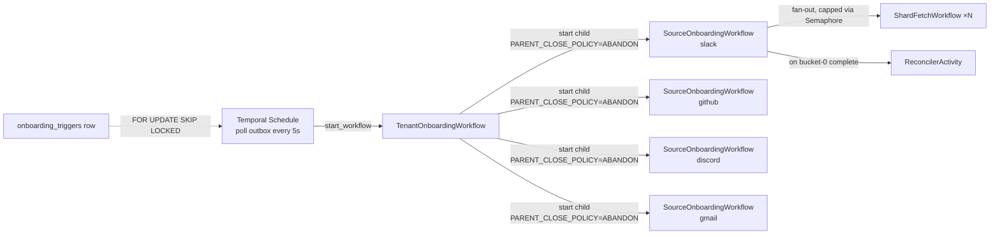

# Fyralis Ingestion — Low-Level Design

**Scope:** Implementation reference for the ingestion pipeline whose shape was established in `02-high-level-design.md` v2.1. An engineer should be able to open this document, pick a section, and produce code that matches the LLD's contracts without further architectural questions.

This document answers **exactly how do I build it?** Sections are numbered 1–10 per the Phase 3 brief, with three appended sections (11, 12, 13) covering Block 3 additions that did not fit cleanly into the original ten.

**Status of claims:** code-cited claims about existing behavior are evidence-based (Phase 1 + verification rounds). DDL, workflow code shapes, pseudocode, and topology specifications are forward-looking *design*: they have not been implemented or tested. The brief assigns the LLD this responsibility deliberately — Phase 4 implementation work will reveal places where this design needs revision.

**Naming convention:** new code lives under `services/ingestion/` and new tables under migrations `0045`+ (next free number; latest is `0044_fix_installation_audit_log_action_check.sql`).

---

## Table of contents

1. [Database schemas](#1-database-schemas)
2. [Temporal workflow code shapes](#2-temporal-workflow-code-shapes)
3. [Per-source planner logic](#3-per-source-planner-logic)
4. [The FetchPage activity anatomy](#4-the-fetchpage-activity-anatomy)
5. [Normalizer process topology](#5-normalizer-process-topology)
6. [Idempotency key constructors](#6-idempotency-key-constructors)
7. [Reconciliation activity](#7-reconciliation-activity)
8. [Failure mode catalog](#8-failure-mode-catalog)
9. [Project structure](#9-project-structure)
10. [Progress contract](#10-progress-contract)
11. [Feature flag + circuit breaker (cutover gating)](#11-feature-flag--circuit-breaker)
12. [One-shot recovery scripts](#12-one-shot-recovery-scripts)
13. [Rate limiter — full Lua script](#13-rate-limiter-lua)

---

## 1. Database schemas

### 1.1 `onboarding_runs`

One row per `TenantOnboardingWorkflow` execution. The aggregate progress record; everything below joins to this.

```sql
-- db/migrations/0045_onboarding_runs.sql
BEGIN;

CREATE TABLE IF NOT EXISTS onboarding_runs (
    id                  UUID         PRIMARY KEY,             -- uuid7() app-side
    tenant_id           UUID         NOT NULL
                                     REFERENCES tenants(id)
                                     DEFERRABLE INITIALLY IMMEDIATE,
    trigger_kind        TEXT         NOT NULL
                                     CHECK (trigger_kind IN (
                                       'install', 'reinstall', 'manual_replay'
                                     )),
    workflow_id         TEXT         NOT NULL,                -- Temporal workflow id (deterministic)
    workflow_run_id     TEXT,                                 -- Temporal run id; NULL until first start
    status              TEXT         NOT NULL DEFAULT 'pending'
                                     CHECK (status IN (
                                       'pending', 'running', 'feels_onboarded',
                                       'complete', 'partial', 'failed', 'cancelled'
                                     )),
    sources_enabled     TEXT[]       NOT NULL,                -- e.g. ['slack','github','gmail']
    started_at          TIMESTAMPTZ,
    feels_onboarded_at  TIMESTAMPTZ,                          -- first source achieving feels_onboarded
    completed_at        TIMESTAMPTZ,
    error_summary       TEXT,
    created_at          TIMESTAMPTZ  NOT NULL DEFAULT now(),
    UNIQUE (tenant_id, workflow_id)
);

CREATE INDEX IF NOT EXISTS onboarding_runs_tenant_status_idx
    ON onboarding_runs (tenant_id, status);

CREATE INDEX IF NOT EXISTS onboarding_runs_status_started_idx
    ON onboarding_runs (status, started_at DESC)
    WHERE status IN ('pending', 'running');

ALTER TABLE onboarding_runs ENABLE ROW LEVEL SECURITY;
ALTER TABLE onboarding_runs FORCE ROW LEVEL SECURITY;
DROP POLICY IF EXISTS tenant_isolation ON onboarding_runs;
CREATE POLICY tenant_isolation ON onboarding_runs
    USING (
        current_setting('app.current_tenant', true) IS NULL
        OR tenant_id = current_setting('app.current_tenant', true)::uuid
    )
    WITH CHECK (
        current_setting('app.current_tenant', true) IS NULL
        OR tenant_id = current_setting('app.current_tenant', true)::uuid
    );

COMMIT;
```

**Column justifications:**

- `workflow_id` is a deterministic string (`tenant-{tenant_id}-onboarding-{trigger_kind}-{timestamp}`). It is the Temporal de-dup mechanism — restarting the trigger workflow with the same `workflow_id` is a no-op if one is already running.
- `workflow_run_id` is NULL until the workflow actually starts. Distinguishing "trigger written but not started" from "trigger started" is the failure mode the outbox pattern solves.
- `sources_enabled` is denormalized from `provider_installations` at trigger time. The set may change later (admin adds Discord); subsequent triggers create new runs.
- `feels_onboarded_at` records the **first** source achieving the milestone, not all sources. Phase 2.1 Q6 decided this is per-source; the aggregate is "any one source" for the user-visible "ready" moment.

### 1.2 `onboarding_shards`

The unit of fetch work. One row per (run, source, shard); workflows read/write here as they progress.

```sql
-- db/migrations/0045_onboarding_runs.sql (continued)

CREATE TABLE IF NOT EXISTS onboarding_shards (
    id                  UUID         PRIMARY KEY,             -- uuid7() app-side
    onboarding_run_id   UUID         NOT NULL
                                     REFERENCES onboarding_runs(id)
                                     ON DELETE CASCADE,
    tenant_id           UUID         NOT NULL,                -- denormalized for RLS + index locality
    source              TEXT         NOT NULL
                                     CHECK (source IN ('slack','github','discord','gmail')),
    shard_kind          TEXT         NOT NULL,                -- per-source: 'channel','repo','mailbox'
    shard_identifier    JSONB        NOT NULL,                -- per-source-specific (see §3)
    window_start        TIMESTAMPTZ,                          -- inclusive; NULL = "all time"
    window_end          TIMESTAMPTZ,                          -- exclusive; NULL = "until now"
    recency_score       DOUBLE PRECISION NOT NULL,            -- exp(-age_days/7); higher = earlier
    state               TEXT         NOT NULL DEFAULT 'pending'
                                     CHECK (state IN (
                                       'pending', 'in_progress', 'done',
                                       'failed', 'reconciliation_resharded'
                                     )),
    cursor_token        TEXT,                                 -- opaque per-source; advanced atomically
    last_cursor_advance TIMESTAMPTZ,
    pages_fetched       INTEGER      NOT NULL DEFAULT 0,
    observations_seen   INTEGER      NOT NULL DEFAULT 0,      -- normalized count (post-dedup)
    parent_shard_id     UUID         REFERENCES onboarding_shards(id),  -- for reconciliation re-shards
    last_error          TEXT,
    started_at          TIMESTAMPTZ,
    completed_at        TIMESTAMPTZ,
    created_at          TIMESTAMPTZ  NOT NULL DEFAULT now()
);

CREATE INDEX IF NOT EXISTS onboarding_shards_run_state_idx
    ON onboarding_shards (onboarding_run_id, state, recency_score DESC);

CREATE INDEX IF NOT EXISTS onboarding_shards_tenant_source_idx
    ON onboarding_shards (tenant_id, source, state);

CREATE INDEX IF NOT EXISTS onboarding_shards_pending_recency_idx
    ON onboarding_shards (source, recency_score DESC)
    WHERE state = 'pending';

ALTER TABLE onboarding_shards ENABLE ROW LEVEL SECURITY;
ALTER TABLE onboarding_shards FORCE ROW LEVEL SECURITY;
DROP POLICY IF EXISTS tenant_isolation ON onboarding_shards;
CREATE POLICY tenant_isolation ON onboarding_shards
    USING (
        current_setting('app.current_tenant', true) IS NULL
        OR tenant_id = current_setting('app.current_tenant', true)::uuid
    )
    WITH CHECK (
        current_setting('app.current_tenant', true) IS NULL
        OR tenant_id = current_setting('app.current_tenant', true)::uuid
    );
```

**Column justifications:**

- `tenant_id` is denormalized from `onboarding_runs.tenant_id`. The RLS policy needs it directly; the alternative is `WHERE EXISTS (SELECT 1 FROM onboarding_runs WHERE …)` which Postgres can rewrite but adds a join and is harder to reason about for the planner.
- `shard_identifier JSONB` is per-source-specific because shard identity is non-uniform. Slack: `{"channel_id":"C01ABC"}`. GitHub: `{"repo_full_name":"acme/api","kind":"issues"}`. Gmail: `{"email":"alice@acme.com"}`. Discord: `{"guild_id":"123","channel_id":"456"}`. JSONB chosen over per-source columns to keep one table without nullable-column sprawl.
- `cursor_token` is opaque per-source. Slack: `next_cursor` string. GitHub: page number as string. Gmail: `nextPageToken` string. Discord: snowflake of the oldest seen message (for `before=` pagination). The shape is set by the planner; the activity treats it as opaque.
- `pages_fetched` and `observations_seen` are progress counters maintained by the FetchPage and writer activities respectively. They are NOT authoritative — they exist for the progress event emitter to compute approximate completion percentages without aggregating across observations. Authoritative counts come from `observations` directly during reconciliation.
- `parent_shard_id` is non-null only for shards created by the reconciler (see §7); enables drill-down "this gap originated from shard X."
- `recency_score` is denormalized from the planner's scoring function. Higher = earlier in priority order. Index `onboarding_shards_pending_recency_idx` enables `SELECT … WHERE state='pending' ORDER BY recency_score DESC LIMIT N` without touching done shards.

### 1.3 `ingestion_failures`

Mirror of `ingestion.dlq` Kafka topic; the queryable surface for ops.

```sql
-- db/migrations/0046_ingestion_failures.sql
BEGIN;

CREATE TABLE IF NOT EXISTS ingestion_failures (
    id                  UUID         PRIMARY KEY,             -- uuid7() app-side
    tenant_id           UUID         NOT NULL
                                     REFERENCES tenants(id),
    source              TEXT         NOT NULL
                                     CHECK (source IN ('slack','github','discord','gmail')),
    failure_kind        TEXT         NOT NULL
                                     CHECK (failure_kind IN (
                                       'normalizer_parse_error',
                                       'observation_insert_error',
                                       'rate_limit_exhausted',
                                       's3_put_failure',
                                       'kafka_publish_failure',
                                       'fetcher_terminal_error',
                                       'reconciliation_gap_unresolved',
                                       'oauth_revoked_mid_run'
                                     )),
    raw_s3_key          TEXT,                                 -- pointer to raw body (if available)
    onboarding_shard_id UUID         REFERENCES onboarding_shards(id),  -- NULL for steady-state failures
    error_summary       TEXT         NOT NULL,                -- short single-line summary
    error_context       JSONB        NOT NULL DEFAULT '{}'::jsonb,
    attempt_count       INTEGER      NOT NULL DEFAULT 1,
    first_seen_at       TIMESTAMPTZ  NOT NULL DEFAULT now(),
    last_seen_at        TIMESTAMPTZ  NOT NULL DEFAULT now(),
    resolved_at         TIMESTAMPTZ,
    resolution_kind     TEXT         CHECK (resolution_kind IS NULL OR resolution_kind IN (
                                       'replayed', 'discarded', 'auto_recovered', 'manual_recovered'
                                     )),
    resolved_by         TEXT
);

CREATE INDEX IF NOT EXISTS ingestion_failures_tenant_source_unresolved_idx
    ON ingestion_failures (tenant_id, source, last_seen_at DESC)
    WHERE resolved_at IS NULL;

CREATE INDEX IF NOT EXISTS ingestion_failures_failure_kind_idx
    ON ingestion_failures (failure_kind, last_seen_at DESC)
    WHERE resolved_at IS NULL;

CREATE INDEX IF NOT EXISTS ingestion_failures_shard_idx
    ON ingestion_failures (onboarding_shard_id)
    WHERE onboarding_shard_id IS NOT NULL;

ALTER TABLE ingestion_failures ENABLE ROW LEVEL SECURITY;
ALTER TABLE ingestion_failures FORCE ROW LEVEL SECURITY;
DROP POLICY IF EXISTS tenant_isolation ON ingestion_failures;
CREATE POLICY tenant_isolation ON ingestion_failures
    USING (
        current_setting('app.current_tenant', true) IS NULL
        OR tenant_id = current_setting('app.current_tenant', true)::uuid
    )
    WITH CHECK (
        current_setting('app.current_tenant', true) IS NULL
        OR tenant_id = current_setting('app.current_tenant', true)::uuid
    );

COMMIT;
```

**Column justifications:**

- The CHECK on `failure_kind` is the enumeration that the failure-mode catalog (§8) writes to. New kinds require both a migration (alter the CHECK) and a catalog entry. Deliberate friction to keep the kinds finite.
- `raw_s3_key` is nullable because some failures (rate-limit-exhausted-pre-fetch, fetcher-terminal-before-any-page) have no raw body. The replay tool checks for NULL before attempting to re-publish.
- `attempt_count` enables UPSERT-on-failure semantics: instead of one row per occurrence, one row per `(tenant_id, source, raw_s3_key, failure_kind)` tuple with a counter. The UPSERT key is enforced by application code (UNIQUE constraint would be too restrictive for the genuinely-distinct-occurrence cases like `reconciliation_gap_unresolved` which has no raw_s3_key).

### 1.4 `onboarding_triggers` (OAuth outbox)

The transactional outbox written by every OAuth callback in the same transaction as the install row. Per Phase 2.1 Q E2/E3 decision.

```sql
-- db/migrations/0047_onboarding_triggers_outbox.sql
BEGIN;

CREATE TABLE IF NOT EXISTS onboarding_triggers (
    id                  UUID         PRIMARY KEY,             -- uuid7() app-side
    tenant_id           UUID         NOT NULL
                                     REFERENCES tenants(id),
    source              TEXT         NOT NULL
                                     CHECK (source IN ('slack','github','discord','gmail')),
    trigger_kind        TEXT         NOT NULL
                                     CHECK (trigger_kind IN ('install','reinstall','manual_replay')),
    installation_row_id UUID,                                 -- nullable for Gmail (uses gmail_installations.id)
    gmail_installation_id UUID,                               -- nullable for Slack/GH/Discord
    payload             JSONB        NOT NULL DEFAULT '{}'::jsonb,
    consumed_at         TIMESTAMPTZ,                          -- set by poller when workflow started
    consumed_by_workflow_id TEXT,                             -- workflow_id the poller created
    consume_attempts    INTEGER      NOT NULL DEFAULT 0,
    last_attempt_at     TIMESTAMPTZ,
    last_error          TEXT,
    created_at          TIMESTAMPTZ  NOT NULL DEFAULT now()
);

CREATE INDEX IF NOT EXISTS onboarding_triggers_unconsumed_idx
    ON onboarding_triggers (created_at)
    WHERE consumed_at IS NULL;

CREATE INDEX IF NOT EXISTS onboarding_triggers_tenant_source_idx
    ON onboarding_triggers (tenant_id, source, created_at DESC);

-- No RLS — the poller runs as a service and reads ALL tenants' rows.
-- The unconsumed_idx is the workload-shaped index for the poller.

COMMIT;
```

**Column justifications:**

- `installation_row_id` and `gmail_installation_id` are mutually exclusive (Gmail uses its own table; Slack/GitHub/Discord use `provider_installations`). The CHECK constraint `(installation_row_id IS NULL) <> (gmail_installation_id IS NULL)` would enforce this; left as application invariant to avoid coupling the migration to both tables' existence.
- `consume_attempts` is incremented even on success so the poller can detect "row stuck claimed-but-not-consumed" (e.g., poller crashed between updating `consume_attempts` and starting the workflow).
- `last_error` records the most recent failure reason so ops can grep `WHERE consume_attempts > 3` for stuck triggers without paging through the workflow history.

**Polling semantics (workflow-side described in §2.4):** the Temporal Schedule pollers run every 5 seconds:

```sql
SELECT id, tenant_id, source, trigger_kind, installation_row_id, gmail_installation_id, payload
FROM onboarding_triggers
WHERE consumed_at IS NULL
  AND (last_attempt_at IS NULL OR last_attempt_at < now() - interval '10 seconds')
ORDER BY created_at
LIMIT 100
FOR UPDATE SKIP LOCKED;
```

The `FOR UPDATE SKIP LOCKED` is critical for multi-pod safety; the `last_attempt_at` guard prevents tight retry on a failing trigger (10s backoff between attempts).

#### 1.4.1 OAuth callback worked example — Slack (Phase 3 review hand-wave 8)

The new shape for [services/integrations/slack/oauth.py:512-633](services/integrations/slack/oauth.py#L512-L633). Phase 2.1 Q E1 verified that today's callback runs install UPSERT + audit + (no outbox) as three separate transactions; this rewrite unifies them.

```python
async def callback_handler(request: Request) -> Any:
    # ... (existing) state-token verify, code exchange with Slack, secrets persist ...
    # All steps prior to the DB write block are unchanged.

    pool = request.app.state.pool
    secret_store = request.app.state.secret_store

    async with tenant_transaction(tenant_id) as tctx:
        # === Single transaction: install row + audit + outbox ===
        # Step A: UPSERT provider_installations.
        # (Cross-tenant collision guard unchanged from existing code; the
        # ON CONFLICT clause now lives inside this transaction.)
        install_row = await tctx.fetchrow(
            """
            INSERT INTO provider_installations (
                id, tenant_id, provider, installation_id, secret_ref, enabled
            ) VALUES ($1, $2, 'slack', $3, $4, TRUE)
            ON CONFLICT (provider, installation_id) DO UPDATE
              SET tenant_id = EXCLUDED.tenant_id,
                  secret_ref = EXCLUDED.secret_ref,
                  enabled = TRUE
              WHERE provider_installations.tenant_id = EXCLUDED.tenant_id
                 OR provider_installations.tenant_id IS NULL
            RETURNING id, (xmax = 0) AS was_inserted
            """,
            uuid7(), tenant_id, team_id, secret_ref,
        )
        if install_row is None:
            # ON CONFLICT WHERE clause failed → cross-tenant collision.
            # Existing handling unchanged; raises and skips the outbox row.
            raise InstallationCollisionError(...)
        installation_row_id = install_row["id"]
        was_inserted = install_row["was_inserted"]

        # Step B: re-install cleanup (delete orphan token rows) — existing logic
        # called via tctx instead of a fresh pool acquire. Pre-cutover audit:
        # confirm the existing helpers accept a TenantContext-or-Connection
        # parameter; small refactor if not.
        if not was_inserted:
            await _delete_orphan_tokens(tctx, tenant_id, team_id)

        # Step C: audit row, in the same transaction.
        await _write_audit(
            tctx,  # was: pool (separate connection)
            tenant_id, installation_row_id, "install", "ok",
            {
                "was_reinstall": not was_inserted,
                "scopes_count": len(scopes),
                "app_id": slack_response.get("app_id"),
            },
        )

        # Step D: NEW — outbox row in the same transaction.
        # If the outbox INSERT fails, the install + audit roll back together.
        # If the commit succeeds, the outbox row IS durable; the
        # OnboardingTriggerPollerWorkflow will see it on its next 5s tick.
        await tctx.execute(
            """
            INSERT INTO onboarding_triggers (
                id, tenant_id, source, trigger_kind,
                installation_row_id, gmail_installation_id, payload
            ) VALUES ($1, $2, 'slack', $3, $4, NULL, $5::jsonb)
            """,
            uuid7(), tenant_id,
            'reinstall' if not was_inserted else 'install',
            installation_row_id,
            json.dumps({"team_id": team_id, "app_id": slack_response.get("app_id")}),
        )
        # === Transaction commits here ===

    # Post-transaction: side effects that are intentionally outside the txn
    # (cache invalidation, metrics, redirect). These are non-transactional
    # because their failure must NOT roll back the install — the user has
    # successfully authorised, and the trigger is durably written.
    _invalidate_resolver_cache(request, team_id)
    metrics.record_install_outcome("success")
    metrics.observe_install_duration(time.monotonic() - started_at)
    return RedirectResponse(
        url=f"{_SUCCESS_REDIRECT}?team={short_team_hash(team_id)}",
        status_code=302,
    )
```

**What changes in helper functions:**

- `_write_audit` ([slack/oauth.py:614-623](services/integrations/slack/oauth.py#L614-L623)) currently accepts a `pool` and opens its own connection. The refactor changes its first parameter to `TenantContext | Connection` so it can be called inside an existing transaction. Same change applies to GitHub (`_audit` at [github/oauth.py:282-300](services/integrations/github/oauth.py#L282-L300)), Discord (`_write_audit` at [discord/oauth.py:560-565](services/integrations/discord/oauth.py#L560-L565)). One helper signature change touches all four callbacks; the cross-cutting refactor is bounded.
- `_delete_orphan_tokens` similarly accepts `TenantContext | Connection`.

**Gmail variant** (worked example at [gmail/oauth.py:151-218](services/integrations/gmail/oauth.py#L151-L218)):

```python
async def connect_finalize(request: Request) -> JSONResponse:
    # ... existing parsing, DWD minter setup ...
    async with tenant_transaction(tenant_id) as tctx:
        # Existing: UPSERT gmail_installations + write_install_audit (already
        # in the same txn at [gmail/oauth.py:172-198]).
        install_id = await _upsert_gmail_installation(tctx, ...)
        await write_install_audit(tctx, gmail_installation_id=install_id, ...)

        # NEW: outbox row, replacing the asyncio.create_task(_provision_install).
        await tctx.execute(
            """
            INSERT INTO onboarding_triggers (
                id, tenant_id, source, trigger_kind,
                installation_row_id, gmail_installation_id, payload
            ) VALUES ($1, $2, 'gmail', 'install', NULL, $3, $4::jsonb)
            """,
            uuid7(), tenant_id, install_id,
            json.dumps({
                "admin_email": admin_email,
                "scope_alias": scope_alias,
                "workspace_domain": workspace_domain,
            }),
        )

    # Removed: asyncio.create_task(_provision_install(...))
    # The TenantOnboardingWorkflow that the poller starts will run
    # _provision_install (or its workflow-activity equivalent) as
    # part of Gmail's plan_shards_gmail activity (§3.4) — same code,
    # called from Temporal instead of fire-and-forget asyncio.

    return JSONResponse(content={
        "ok": True,
        "installation_id": str(install_id),
        "scope": scope_alias,
        "provisioning": "queued",  # was: "started"
    })
```

**The Gmail change is the bigger user-visible delta:** the response shape changes from `"provisioning": "started"` to `"provisioning": "queued"`. Frontend code consuming this string must be updated (or accept both during cutover). Out of scope for ingestion; flag for the frontend team's awareness.

**Failure modes:**

- Outbox INSERT fails (constraint violation, DB unavailable mid-transaction): the entire transaction rolls back. The user sees a 5xx response. The install never lands. They retry the OAuth flow. **Acceptable** because we want install + workflow-trigger to be atomic.
- Outbox INSERT succeeds but poller never picks it up (e.g., Temporal is down for days): the row stays unconsumed. The diagnostic query is `SELECT count(*) FROM onboarding_triggers WHERE consumed_at IS NULL AND created_at < now() - interval '1 hour'`. Alert at >5 such rows.

### 1.5 `gateway_session_state` (Discord)

Replaces in-memory `session_id` / `last_seq` storage. UPSERT on every dispatched frame (Phase 2.1 risk #3 fix).

```sql
-- db/migrations/0048_gateway_session_state.sql
BEGIN;

CREATE TABLE IF NOT EXISTS gateway_session_state (
    id                      UUID         PRIMARY KEY,             -- uuid7() app-side
    -- Single row per (gateway-app), but the structure is per-shard if/when sharding lands.
    shard_id                INTEGER      NOT NULL DEFAULT 0,      -- 0 for single-shard
    application_id          TEXT         NOT NULL,                -- Discord app id
    session_id              TEXT,                                 -- last seen Discord session
    resume_gateway_url      TEXT,                                 -- last seen RESUME URL
    last_seq                BIGINT,                               -- last seen sequence number
    heartbeat_interval_ms   INTEGER,
    last_heartbeat_ack_at   TIMESTAMPTZ,
    last_dispatched_at      TIMESTAMPTZ,
    leader_lease_holder     TEXT,                                 -- pod identifier
    leader_lease_expires_at TIMESTAMPTZ,                          -- Redis-lock mirror; informational
    updated_at              TIMESTAMPTZ  NOT NULL DEFAULT now(),
    UNIQUE (application_id, shard_id)
);

CREATE INDEX IF NOT EXISTS gateway_session_state_active_idx
    ON gateway_session_state (application_id, shard_id);

-- No RLS — Discord Gateway is app-level, not per-tenant.

COMMIT;
```

**Column justifications:**

- `shard_id` is `0` for the single-shard v1 deployment. When/if multi-shard ships (deferred in HLD), one row per shard.
- The UNIQUE on `(application_id, shard_id)` enforces "one session state per shard." UPSERT via `ON CONFLICT (application_id, shard_id) DO UPDATE`.
- `leader_lease_holder` and `leader_lease_expires_at` are **informational** — the actual lease lives in Redis (see §13). The DB columns are for diagnostics ("which pod thinks it's the leader right now") and for the operator who must debug a split-brain. The Redis lease is the authority.

### 1.6 Functional index for `entity_aliases` (Phase 2.1 Q1)

Required for the batched alias lookups to perform. Per the user's confirmation: functional index over generated-stored-column.

```sql
-- db/migrations/0049_entity_aliases_normalized_index.sql
BEGIN;

CREATE INDEX CONCURRENTLY IF NOT EXISTS entity_aliases_normalized_idx
    ON entity_aliases (
        tenant_id,
        (regexp_replace(lower(alias_text), '\s+', ' ', 'g'))
    );

-- After successful build, this index allows:
--   WHERE tenant_id = $1
--     AND regexp_replace(lower(alias_text), '\s+', ' ', 'g') = ANY($2::text[])
-- to use index lookups for each element of the array (via the planner's
-- ANY-to-IN rewrite). The existing aliases_text_idx on (tenant_id, alias_text)
-- stays — it serves the by-raw-text retrieval path.

COMMIT;
```

**Notes:**

- `CONCURRENTLY` is mandatory; the table may be large in some tenants and the migration must not block writers. `CONCURRENTLY` cannot run inside a transaction block, so this migration uses `BEGIN`/`COMMIT` for the file structure only — the migration runner must detect `CONCURRENTLY` and dispatch outside a transaction (per the project's existing migration runner convention; verify before deploying).
- The expression must match the application's `normalize_phrase()` exactly. Mismatch produces a silent table-scan fallback. The LLD pairs this migration with a test that asserts `EXPLAIN (FORMAT JSON) … ANY(…)` shows `Index Scan using entity_aliases_normalized_idx`.

### 1.7 Cutover feature flag

Per Phase 2.1 Edit 6. Stored in a new `tenant_flags` table to avoid bloating `tenants` with a column that will be removed post-migration.

```sql
-- db/migrations/0050_tenant_flags.sql
BEGIN;

CREATE TABLE IF NOT EXISTS tenant_flags (
    tenant_id   UUID         NOT NULL REFERENCES tenants(id),
    flag_name   TEXT         NOT NULL,
    flag_value  BOOLEAN      NOT NULL DEFAULT false,
    set_by      TEXT,                                  -- operator id or 'auto:circuit_breaker'
    set_at      TIMESTAMPTZ  NOT NULL DEFAULT now(),
    note        TEXT,
    PRIMARY KEY (tenant_id, flag_name)
);

-- No RLS — the flag is a service-level concern; readers run with service role.

COMMIT;
```

**Initial flag**: `ingestion.kafka_path_enabled`. Default missing → treat as `false` (inline path). See §11.

---

## 2. Temporal workflow code shapes

### 2.1 Workflow tree (recap)



### 2.2 `OnboardingTriggerPollerWorkflow` (Temporal Schedule)

Runs every 5 seconds; consumes outbox rows.

```python
# services/ingestion/workflows/poller.py
from temporalio import workflow
from temporalio.common import RetryPolicy
from datetime import timedelta

@workflow.defn
class OnboardingTriggerPollerWorkflow:
    @workflow.run
    async def run(self) -> int:
        """Poll the outbox once; start TenantOnboardingWorkflow for each
        unconsumed trigger. Returns count consumed for observability.
        """
        rows = await workflow.execute_activity(
            claim_unconsumed_triggers,
            ClaimArgs(batch_size=100, stale_after_seconds=10),
            start_to_close_timeout=timedelta(seconds=10),
            retry_policy=RetryPolicy(maximum_attempts=3),
        )
        consumed = 0
        for row in rows:
            child_wf_id = (
                f"tenant-{row.tenant_id}-onboarding-{row.trigger_kind}-{row.created_at_ms}"
            )
            try:
                # PARENT_CLOSE_POLICY=ABANDON: poller restart must not cancel running TOWs.
                await workflow.start_child_workflow(
                    TenantOnboardingWorkflow.run,
                    TenantOnboardingArgs(
                        tenant_id=row.tenant_id,
                        source=row.source,
                        trigger_kind=row.trigger_kind,
                        installation_row_id=row.installation_row_id,
                        gmail_installation_id=row.gmail_installation_id,
                        outbox_row_id=row.id,
                    ),
                    id=child_wf_id,
                    task_queue="onboarding",
                    id_reuse_policy=workflow.WorkflowIDReusePolicy.ALLOW_DUPLICATE_FAILED_ONLY,
                    parent_close_policy=workflow.ParentClosePolicy.ABANDON,
                )
                await workflow.execute_activity(
                    mark_trigger_consumed,
                    MarkConsumedArgs(outbox_row_id=row.id, workflow_id=child_wf_id),
                    start_to_close_timeout=timedelta(seconds=5),
                )
                consumed += 1
            except workflow.WorkflowAlreadyStartedError:
                # The only realistic path here: this poller previously executed
                # `start_child_workflow` for this outbox row but crashed before
                # `mark_trigger_consumed`. On restart, `claim_unconsumed_triggers`
                # returned the still-unconsumed row, and the deterministic
                # `child_wf_id` from `created_at_ms` collides with the prior run.
                # Cross-pod claim races are NOT a source: `FOR UPDATE SKIP LOCKED`
                # in the claim query serialises pollers at the SQL layer.
                # Treat as already-claimed-success and mark consumed.
                await workflow.execute_activity(mark_trigger_consumed, …)
                consumed += 1
            except Exception as exc:
                await workflow.execute_activity(
                    record_trigger_failure,
                    RecordFailureArgs(outbox_row_id=row.id, error=str(exc)[:500]),
                    start_to_close_timeout=timedelta(seconds=5),
                )
        return consumed
```

**Schedule definition** (registered at worker startup, not in workflow code):

```python
from temporalio.client import Schedule, ScheduleActionStartWorkflow, ScheduleIntervalSpec, ScheduleSpec
from datetime import timedelta

await client.create_schedule(
    "onboarding-trigger-poller",
    Schedule(
        action=ScheduleActionStartWorkflow(
            OnboardingTriggerPollerWorkflow.run,
            id="onboarding-trigger-poller",
            task_queue="onboarding-poller",
        ),
        spec=ScheduleSpec(intervals=[ScheduleIntervalSpec(every=timedelta(seconds=5))]),
        policy=SchedulePolicy(overlap=ScheduleOverlapPolicy.SKIP),  # don't pile up
    ),
)
```

`SKIP` overlap policy means a slow poll does not stack — at most one poller workflow runs at a time. If polling takes longer than 5s, subsequent fires are skipped (logged as "schedule overlap" by Temporal). Acceptable; the next fire picks up.

### 2.3 `TenantOnboardingWorkflow`

```python
# services/ingestion/workflows/tenant.py
from temporalio import workflow

@workflow.defn
class TenantOnboardingWorkflow:
    @workflow.run
    async def run(self, args: TenantOnboardingArgs) -> TenantOnboardingResult:
        # Step 1: create the onboarding_runs row (idempotent on workflow_id).
        run_id = await workflow.execute_activity(
            create_or_get_onboarding_run,
            CreateRunArgs(
                tenant_id=args.tenant_id,
                trigger_kind=args.trigger_kind,
                workflow_id=workflow.info().workflow_id,
                workflow_run_id=workflow.info().run_id,
                sources_enabled=[args.source],  # one source per trigger
            ),
            start_to_close_timeout=timedelta(seconds=10),
            retry_policy=RetryPolicy(maximum_attempts=5),
        )

        # Step 2: emit tenant.onboarding.started.
        await workflow.execute_activity(
            publish_progress_event,
            ProgressEvent(
                kind="tenant.onboarding.started",
                tenant_id=args.tenant_id,
                body={
                    "started_at": workflow.now().isoformat(),
                    "sources": [args.source],
                    "eta_minutes": 60,
                },
            ),
            start_to_close_timeout=timedelta(seconds=5),
        )

        # Step 3: spawn the per-source workflow as a child (ABANDON close policy).
        # Use `start_child_workflow` (returns a handle after the child is STARTED)
        # not `execute_child_workflow` (which awaits child completion). We do NOT
        # await the handle's result — the child is fire-and-forget under ABANDON.
        source_wf_id = f"ten-{args.tenant_id}-{args.source}-{workflow.info().workflow_id}"
        _handle = await workflow.start_child_workflow(
            SourceOnboardingWorkflow.run,
            SourceOnboardingArgs(
                tenant_id=args.tenant_id,
                onboarding_run_id=run_id,
                source=args.source,
                installation_row_id=args.installation_row_id,
                gmail_installation_id=args.gmail_installation_id,
            ),
            id=source_wf_id,
            task_queue=f"{args.source}",
            parent_close_policy=workflow.ParentClosePolicy.ABANDON,
        )
        # The await above blocks only until the child is registered with Temporal,
        # not until it completes. ABANDON means parent exit does not cancel the
        # child. Tenant workflow returns immediately after this.

        return TenantOnboardingResult(run_id=run_id, source_workflow_id=source_wf_id)
```

**Why one source per trigger** instead of all-sources-at-once: each OAuth callback fires its own outbox row for its source. Slack and GitHub are independent installs that can complete weeks apart; bundling them under one trigger would couple their progress. The user-facing aggregate (Bridge) joins source workflows by tenant_id.

### 2.4 `SourceOnboardingWorkflow`

```python
# services/ingestion/workflows/source.py
@workflow.defn
class SourceOnboardingWorkflow:
    @workflow.run
    async def run(self, args: SourceOnboardingArgs) -> SourceOnboardingResult:
        # Step 1: planner discovers shards and writes them to onboarding_shards.
        shard_manifest = await workflow.execute_activity(
            f"plan_shards_{args.source}",  # dispatch by source name
            PlanShardsArgs(
                tenant_id=args.tenant_id,
                onboarding_run_id=args.onboarding_run_id,
                installation_row_id=args.installation_row_id,
                gmail_installation_id=args.gmail_installation_id,
            ),
            start_to_close_timeout=timedelta(minutes=10),
            retry_policy=RetryPolicy(
                initial_interval=timedelta(seconds=5),
                maximum_interval=timedelta(minutes=2),
                maximum_attempts=5,
            ),
        )

        await workflow.execute_activity(
            publish_progress_event,
            ProgressEvent(
                kind="source.onboarding.started",
                tenant_id=args.tenant_id,
                body={
                    "source": args.source,
                    "started_at": workflow.now().isoformat(),
                    "planned_shard_count": len(shard_manifest.shard_ids),
                },
            ),
            start_to_close_timeout=timedelta(seconds=5),
        )

        # Step 2: spawn ShardFetchWorkflows with concurrency cap.
        # The Semaphore caps THIS workflow's in-flight shards. Cross-tenant
        # contention on the task queue is FIFO (HLD §Failure Isolation).
        #
        # **asyncio primitives in workflows:** the Temporal Python SDK runs
        # workflow code under a deterministic asyncio scheduler within the
        # workflow sandbox; `asyncio.Semaphore`, `asyncio.create_task`, and
        # `asyncio.gather` are explicitly supported (Temporal Python SDK docs:
        # "Workflow features — asyncio", https://python.temporal.io/temporalio.workflow.html
        # and the sandbox docs at https://docs.temporal.io/develop/python/python-sdk-sandbox).
        # Tests must assert deterministic replay via Temporal's `time-skipping
        # test framework` before this code ships.
        semaphore = asyncio.Semaphore(CONCURRENCY_CAP[args.source])

        async def run_one_shard(shard_id: UUID) -> None:
            async with semaphore:
                await workflow.execute_child_workflow(
                    ShardFetchWorkflow.run,
                    ShardFetchArgs(shard_id=shard_id, tenant_id=args.tenant_id),
                    id=f"shard-{shard_id}",
                    task_queue=f"{args.source}",
                    parent_close_policy=workflow.ParentClosePolicy.TERMINATE,  # cancel on parent fail
                )

        # Spawn all shards in recency order. Each task respects the semaphore.
        shard_tasks = [
            asyncio.create_task(run_one_shard(sid))
            for sid in shard_manifest.shard_ids_recency_ordered
        ]

        # Step 3: NO in-workflow feels_onboarded polling. The condition is
        # checked by a separate `FeelsOnboardedMonitorWorkflow` running on a
        # Temporal Schedule (see §2.6). That workflow scans all running
        # SourceOnboardingWorkflows, measures the gap, and emits the
        # progress event when met. It also updates
        # `onboarding_runs.feels_onboarded_at`. No signal back to this
        # workflow is needed — feels_onboarded is a Bridge-layer event,
        # not a workflow-control event.
        #
        # Rationale (Phase 3 review push 5): a 30s in-workflow poll over
        # an 8-hour backfill adds ~960 activity invocations × ~4 events
        # each = ~3840 events to workflow history per source. For a tenant
        # with 4 sources, that's ~15K events just for polling — non-trivial
        # against the 50K mandatory continue-as-new threshold. Externalising
        # the poll keeps source workflow history bounded by shard count.

        # Step 4: wait for all shards to complete (or fail).
        await asyncio.gather(*shard_tasks, return_exceptions=True)

        # Step 5: reconciliation pass.
        reconciliation_result = await workflow.execute_activity(
            f"reconcile_{args.source}",
            ReconcileArgs(
                tenant_id=args.tenant_id,
                onboarding_run_id=args.onboarding_run_id,
            ),
            start_to_close_timeout=timedelta(minutes=15),
            retry_policy=RetryPolicy(maximum_attempts=2),
        )

        if reconciliation_result.new_shards_created > 0:
            # Re-fan-out the new reconciliation shards (single pass; no further
            # reconciliation to keep workflow bounded).
            recon_shard_tasks = [
                asyncio.create_task(run_one_shard(sid))
                for sid in reconciliation_result.new_shard_ids
            ]
            await asyncio.gather(*recon_shard_tasks, return_exceptions=True)

        # Step 6: emit source.onboarding.complete + tenant.onboarding.complete
        # (the latter only if this was the last source; check is in the activity).
        await workflow.execute_activity(
            publish_completion_events,
            CompletionArgs(
                tenant_id=args.tenant_id,
                onboarding_run_id=args.onboarding_run_id,
                source=args.source,
            ),
            start_to_close_timeout=timedelta(seconds=10),
        )

        return SourceOnboardingResult(
            shards_completed=len(shard_tasks),
            reconciliation_shards=reconciliation_result.new_shards_created,
        )

CONCURRENCY_CAP: dict[str, int] = {
    # NOTE (Phase 3 review push 6): these caps bound activity slots in flight,
    # NOT sustained API throughput. Sustained throughput is governed by the
    # rate-limiter buckets. The cap controls burst (initial first-page coverage)
    # and worker-slot consumption while shards wait for tokens. See §3.1 for the
    # full burst-vs-sustained discussion using Slack as the worked example;
    # GitHub/Discord/Gmail follow the same shape.
    "slack": 10,    # burst across 10 channels at start; sustained = 40/min bucket-bound
    "github": 8,    # burst across 8 repo-kinds; sustained = 4000/hr bucket-bound
    "discord": 6,   # burst across 6 channels; sustained = ~5/sec bucket-bound
    "gmail": 20,    # burst across 20 mailboxes; sustained = 200/sec per-user (cap is binding here, not bucket)
}
```

**Notes on workflow design:**

- `parent_close_policy=TERMINATE` on `ShardFetchWorkflow` children (within the source workflow) means a failed source workflow cancels its in-flight shards. Conversely, `parent_close_policy=ABANDON` on `SourceOnboardingWorkflow` (within the tenant workflow) means the tenant workflow can exit without killing source backfills. These are deliberate: source backfills are long; the tenant trigger workflow is short.
- The `Semaphore` is per-workflow-execution. Cross-tenant fairness on the task queue is FIFO (Phase 2.1 verification Q B1). The semaphore only prevents one tenant from burst-scheduling. Premium-tier per-tenant task queues (HLD opt-in path) are the answer if FIFO becomes unfair in practice.
- Feels-onboarded signal: NOT polled in this workflow. See §2.6 for the externalised `FeelsOnboardedMonitorWorkflow` on a Temporal Schedule. Source workflow holds no polling state.

### 2.5 `ShardFetchWorkflow`

```python
# services/ingestion/workflows/shard.py
@workflow.defn
class ShardFetchWorkflow:
    @workflow.run
    async def run(self, args: ShardFetchArgs) -> ShardFetchResult:
        # Step 1: load shard state.
        shard = await workflow.execute_activity(
            load_shard,
            LoadShardArgs(shard_id=args.shard_id),
            start_to_close_timeout=timedelta(seconds=10),
            retry_policy=RetryPolicy(maximum_attempts=3),
        )
        if shard.state == 'done':
            return ShardFetchResult(pages=0, observations=0, status='already_done')

        await workflow.execute_activity(
            mark_shard_in_progress,
            MarkInProgressArgs(shard_id=args.shard_id),
            start_to_close_timeout=timedelta(seconds=5),
        )

        pages_fetched = 0
        cursor_token = shard.cursor_token  # may be None for first page

        while True:
            # Step 2: FetchPage activity (see §4 for the 6-step anatomy).
            page = await workflow.execute_activity(
                f"fetch_page_{shard.source}",
                FetchPageArgs(
                    shard_id=args.shard_id,
                    tenant_id=args.tenant_id,
                    shard_identifier=shard.shard_identifier,
                    cursor_token=cursor_token,
                ),
                start_to_close_timeout=timedelta(seconds=60),
                heartbeat_timeout=timedelta(seconds=20),  # for long-running pagination
                retry_policy=RetryPolicy(
                    initial_interval=timedelta(seconds=1),
                    backoff_coefficient=2.0,
                    maximum_interval=timedelta(minutes=2),
                    maximum_attempts=5,
                    non_retryable_error_types=[
                        "OAuthRevokedError",
                        "InstallationDisabledError",
                        "TerminalSourceError",
                    ],
                ),
            )
            pages_fetched += 1

            # Step 3: advance cursor in a SEPARATE activity.
            # This is the brief's non-negotiable: "cursor advancement is a separate
            # Temporal activity from page fetch — never collapsed into one step."
            await workflow.execute_activity(
                advance_shard_cursor,
                AdvanceCursorArgs(
                    shard_id=args.shard_id,
                    new_cursor_token=page.next_cursor,
                    pages_fetched_delta=1,
                ),
                start_to_close_timeout=timedelta(seconds=5),
                retry_policy=RetryPolicy(maximum_attempts=10),
            )

            if page.next_cursor is None:
                break
            cursor_token = page.next_cursor

        # Step 4: mark shard done.
        await workflow.execute_activity(
            mark_shard_done,
            MarkDoneArgs(shard_id=args.shard_id),
            start_to_close_timeout=timedelta(seconds=5),
        )

        # Step 5: emit shard.fetched.
        await workflow.execute_activity(
            publish_progress_event,
            ProgressEvent(
                kind="shard.fetched",
                tenant_id=args.tenant_id,
                body={
                    "source": shard.source,
                    "shard_id": str(args.shard_id),
                    "observation_count": …,  # filled by the activity
                    "fetched_in_seconds": …,
                },
            ),
            start_to_close_timeout=timedelta(seconds=5),
        )

        return ShardFetchResult(pages=pages_fetched, observations=…, status='done')
```

**Heartbeat:** the FetchPage activity heartbeats every ~10s. If a worker crashes mid-fetch, Temporal detects the heartbeat timeout (20s) and reschedules the activity; the retry sees the same `cursor_token` (because AdvanceCursor never ran) and re-fetches the same page. S3 PutIfAbsent dedups the raw write; Kafka idempotent producer dedups the publish; observation UNIQUE dedups the insert. End-to-end: zero duplicate observations from a mid-fetch crash.

**Non-retryable errors:**
- `OAuthRevokedError`: 401/403 with "token revoked" semantics. Mark the installation disabled (per existing chokepoint logic); the workflow exits with `status='failed'`.
- `InstallationDisabledError`: thrown if `provider_installations.enabled=false` is detected mid-run (operator action).
- `TerminalSourceError`: a 4xx that the source documents as permanent (e.g., GitHub 410 "issue deleted" for an entity-specific fetch).

### 2.6 `FeelsOnboardedMonitorWorkflow` (added per Phase-3 review push 5)

Out-of-workflow polling for the `source.onboarding.feels_onboarded` condition. Externalised from `SourceOnboardingWorkflow` to keep that workflow's history bounded by shard count, not by elapsed wall time.

```python
# services/ingestion/workflows/feels_onboarded_monitor.py
@workflow.defn
class FeelsOnboardedMonitorWorkflow:
    @workflow.run
    async def run(self) -> MonitorResult:
        """Single-tick monitor. Triggered every 30s by a Temporal Schedule.
        Each invocation is short (a few activities); history is bounded.
        """
        runs = await workflow.execute_activity(
            load_active_onboarding_runs,
            start_to_close_timeout=timedelta(seconds=10),
        )
        emitted = 0
        for run in runs:
            for source in run.sources_enabled:
                # Skip sources that already emitted feels_onboarded for this run.
                if await workflow.execute_activity(
                    feels_onboarded_already_emitted,
                    FeelsCheckArgs(run_id=run.id, source=source),
                    start_to_close_timeout=timedelta(seconds=5),
                ):
                    continue
                gap = await workflow.execute_activity(
                    measure_recency_gap,
                    MeasureGapArgs(
                        tenant_id=run.tenant_id,
                        source=source,
                        window_start=workflow.now() - timedelta(days=7),
                        window_end=workflow.now(),
                    ),
                    start_to_close_timeout=timedelta(seconds=30),
                )
                if gap.below_threshold:
                    await workflow.execute_activity(
                        emit_feels_onboarded_and_stamp_run,
                        EmitFeelsArgs(
                            run_id=run.id,
                            tenant_id=run.tenant_id,
                            source=source,
                            observations_count=gap.observation_count,
                        ),
                        start_to_close_timeout=timedelta(seconds=10),
                    )
                    emitted += 1
        return MonitorResult(runs_scanned=len(runs), emitted=emitted)
```

The `emit_feels_onboarded_and_stamp_run` activity is a single transaction:
1. `UPDATE onboarding_runs SET feels_onboarded_at = now() WHERE id = $1 AND feels_onboarded_at IS NULL` — atomic, idempotent.
2. Only if the UPDATE affected 1 row, publish the `source.onboarding.feels_onboarded` event to Kafka.

The UPDATE guard means concurrent monitor invocations are safe (cluster-of-pods scenario), and re-firing the same condition is a no-op.

**Schedule definition** (registered at worker startup):

```python
await client.create_schedule(
    "feels-onboarded-monitor",
    Schedule(
        action=ScheduleActionStartWorkflow(
            FeelsOnboardedMonitorWorkflow.run,
            id="feels-onboarded-monitor",
            task_queue="onboarding-monitor",
        ),
        spec=ScheduleSpec(intervals=[ScheduleIntervalSpec(every=timedelta(seconds=30))]),
        policy=SchedulePolicy(overlap=ScheduleOverlapPolicy.SKIP),
    ),
)
```

**Counter-argument the review asked for (push 5):** the in-workflow polling has one benefit — when the condition fires, the source workflow could react (e.g., reduce concurrency to free rate budget for steady-state). The externalised monitor cannot trigger such reactions without a Temporal Signal back to the source workflow. **The current design does not need such reactions** (feels_onboarded is a Bridge-layer event only), so the externalised shape is strictly better. If a future feature needs source-workflow reactivity, add a Signal at that point; do not pre-build it.

---

## 3. Per-source planner logic

The planner is one activity per source. Its job: take the install metadata, produce shard rows.

### 3.1 Slack planner

**Discovery:** list channels via `conversations.list` paginated. Default scope is public; admin choice (private + DM) future-flagged. The planner uses the bot token from `encrypted_secrets`.

**Shard decomposition:** one shard per channel, time-windowed in 30-day buckets. Most-recent bucket (last 30 days) gets recency_score 1.0; each older bucket halves. For a 2-year-old channel, that's ~24 shards.

```python
async def plan_shards_slack(args: PlanShardsArgs) -> ShardManifest:
    bot_token = await resolve_bot_token(args.tenant_id, args.installation_row_id)
    client = SlackClient(bot_token)

    channels: list[dict] = []
    cursor = None
    while True:
        resp = await client.conversations_list(
            types="public_channel", limit=200, cursor=cursor,
        )
        channels.extend(resp["channels"])
        cursor = resp.get("response_metadata", {}).get("next_cursor")
        if not cursor:
            break

    now = datetime.now(tz=timezone.utc)
    shards: list[ShardRow] = []
    for ch in channels:
        created_ts = datetime.fromtimestamp(ch["created"], tz=timezone.utc)
        window_end = now
        while window_end > created_ts:
            window_start = max(created_ts, window_end - timedelta(days=30))
            age_days = (now - window_end).days
            shards.append(ShardRow(
                source='slack',
                shard_kind='channel_window',
                shard_identifier={"channel_id": ch["id"], "channel_name": ch["name"]},
                window_start=window_start,
                window_end=window_end,
                recency_score=math.exp(-age_days / 7),
            ))
            window_end = window_start

    return await persist_shard_rows(args.onboarding_run_id, shards)
```

**Cursor shape:** Slack's `conversations.history` uses `cursor` opaque string. Activity stores it as-is in `onboarding_shards.cursor_token`. The first page request omits `cursor`; subsequent requests pass it.

**Rate-limit buckets:** `(tenant, 'slack', 'conversations.list')` and `(tenant, 'slack', 'conversations.history')` separately. Slack's published rate is Tier 3 (50/min for these methods); the bucket caps at 40/min.

**Concurrency cap:** 10 (per `CONCURRENCY_CAP['slack']`). **Important burst-vs-sustained distinction** (Phase 3 review push 6): the cap governs activity concurrency, not sustained API throughput. Math:

- Bucket capacity 40, refill 0.67/sec → sustained throughput is 0.67 calls/sec **shared across all in-flight shards** regardless of cap.
- With cap=10: initial 10 shards consume 10 tokens in ~1 second (burst), then serialize at 0.67/sec total. Per-shard sustained rate ≈ 0.067 calls/sec.
- With cap=4: initial 4 shards consume 4 tokens immediately, then same 0.67/sec sustained. Per-shard sustained rate ≈ 0.17 calls/sec.

Sustained total throughput is the same either way; the cap only affects burst behavior at workflow start. Setting cap=10 gives faster first-page coverage across more channels concurrently (relevant for the feels_onboarded window), at the cost of more activity slots held while waiting for tokens. Setting cap=4 better matches sustained throughput and wastes fewer worker slots in the bucket-wait state.

**Future refinement (deferred):** instead of the FetchPage activity sleeping in the bucket-wait, raise `RateLimited(retry_after_ms)` and let Temporal's retry policy schedule the retry without holding an activity slot. This eliminates the worker-utilisation cost of cap=10 and lets us safely raise the cap further. The infrastructure is in place (`RateLimited` exception type is in §4.2); the FetchPage step 1 change is mechanical. Not in cutover scope.

**Why not lower cap=10 to cap=4 now:** the burst benefit at workflow start is real for the feels_onboarded window — having 10 channels' first pages land in the first second produces a "data appearing" UX moment immediately rather than 1.5s later. Keep cap=10 with documented burst-vs-sustained behavior; revisit when the no-block-in-bucket refinement ships.

### 3.2 GitHub planner

**Discovery:** list installation repositories via `GET /installation/repositories` (the same call IN-13 makes at OAuth callback time; already exists in [github/client.py:226](services/integrations/github/client.py#L226)). Cap at 90 repos for v1 (existing limit; preserved).

**Shard decomposition:** per-repo, per-event-kind. The 6 event types in `_EVENT_SHAPERS` are reduced to 3 fetch kinds because GitHub's APIs are not 1:1 with webhook event types:
- `issues_and_prs`: `GET /repos/{owner}/{repo}/issues?state=all` (returns both issues and PRs)
- `commits`: `GET /repos/{owner}/{repo}/commits`
- `comments`: `GET /repos/{owner}/{repo}/issues/comments` + `GET /repos/{owner}/{repo}/pulls/comments`

Each kind is time-windowed in 90-day buckets (GitHub's REST is generous on history; fewer shards reduce orchestration overhead).

```python
async def plan_shards_github(args: PlanShardsArgs) -> ShardManifest:
    client = await build_github_client(args.tenant_id, args.installation_row_id)
    repos = await client.list_installation_repositories()

    now = datetime.now(tz=timezone.utc)
    shards: list[ShardRow] = []
    for repo in repos:
        for kind in ("issues_and_prs", "commits", "comments"):
            window_end = now
            for bucket in range(8):  # ~2 years of history at 90-day buckets
                window_start = window_end - timedelta(days=90)
                age_days = bucket * 90
                shards.append(ShardRow(
                    source='github',
                    shard_kind=f'repo_{kind}',
                    shard_identifier={"repo_full_name": repo["full_name"], "kind": kind},
                    window_start=window_start,
                    window_end=window_end,
                    recency_score=math.exp(-age_days / 14),  # GitHub recency decays slower
                ))
                window_end = window_start

    return await persist_shard_rows(args.onboarding_run_id, shards)
```

**Cursor shape:** GitHub's REST pagination is `Link` header-based; the activity extracts `?page=N` from the `rel="next"` link and stores `N` as the cursor token.

**Rate-limit buckets:** per `(tenant, 'github', 'rest_authenticated')` — GitHub's 5000/hour is the installation-token quota, shared across all REST endpoints. One bucket per installation suffices for v1; method-specific buckets defer until a noisy method is observed.

**Concurrency cap:** 8. Combined with 90 repos × 3 kinds × 8 buckets ≈ 2160 shards, full backfill takes hours; the cap prevents bursting through the hourly quota in minutes.

### 3.3 Discord planner

**Discovery:** the bot's installed guilds are not knowable from the Gateway (the worker discovers them via `GUILD_CREATE` frames after IDENTIFY). For backfill, the planner needs an explicit guild list — the install OAuth flow records `guild_id` per install in `provider_installations.installation_id`.

**Shard decomposition:** per-guild, per-text-channel, time-windowed in 30-day buckets. The planner first calls `GET /guilds/{guild_id}/channels` to enumerate channels.

```python
async def plan_shards_discord(args: PlanShardsArgs) -> ShardManifest:
    client = await build_discord_client(args.tenant_id, args.installation_row_id)
    guild_id = await resolve_guild_id(args.installation_row_id)
    channels = await client.get_guild_channels(guild_id)

    # type 0 = GUILD_TEXT; other types (voice, category, etc.) ignored.
    text_channels = [c for c in channels if c["type"] == 0]

    now = datetime.now(tz=timezone.utc)
    shards: list[ShardRow] = []
    for ch in text_channels:
        window_end = now
        for bucket in range(12):  # ~1 year at 30-day buckets
            window_start = window_end - timedelta(days=30)
            age_days = bucket * 30
            shards.append(ShardRow(
                source='discord',
                shard_kind='channel_window',
                shard_identifier={"guild_id": guild_id, "channel_id": ch["id"]},
                window_start=window_start,
                window_end=window_end,
                recency_score=math.exp(-age_days / 7),
            ))
            window_end = window_start

    return await persist_shard_rows(args.onboarding_run_id, shards)
```

**Cursor shape:** Discord paginates `channels/{id}/messages` via `before=<snowflake>` (descending) or `after=<snowflake>` (ascending). Backfill uses `before=` from current time, so the cursor is the oldest snowflake seen so far. First page omits `before=`; subsequent pages use the smallest message_id from the previous page.

**Rate-limit buckets:** Discord buckets are dynamic and returned in response headers (`X-RateLimit-Bucket`). For v1, the planner uses a coarse per-`(tenant, 'discord', 'channels_messages')` bucket; the activity adjusts based on `X-RateLimit-Remaining` in responses. Discord's globally-allocated bucket math is documented but not deterministic; the v1 approach is conservative.

**Concurrency cap:** 6.

### 3.4 Gmail planner

**Discovery:** the inclusion-spec resolution (`resolve_inclusion` from existing code at [gmail/directory.py:50-105](services/integrations/gmail/directory.py#L50-L105)) produces the user list. The planner consumes that.

**Shard decomposition:** one shard per mailbox, time-windowed in 30-day buckets via Gmail's `users.messages.list?q=after:<unix>+before:<unix>`.

```python
async def plan_shards_gmail(args: PlanShardsArgs) -> ShardManifest:
    install = await load_gmail_installation(args.gmail_installation_id)
    minter = get_minter()
    async with GoogleHttpClient(minter) as http:
        directory = DirectoryClient(http, install.admin_email)
        emails = await resolve_inclusion(
            directory,
            workspace_domain=install.workspace_domain,
            inclusion_spec=install.inclusion_spec,
            optouts=await fetch_optout_emails(args.gmail_installation_id),
        )

    now = datetime.now(tz=timezone.utc)
    shards: list[ShardRow] = []
    for email in emails:
        window_end = now
        for bucket in range(24):  # ~2 years at 30-day buckets
            window_start = window_end - timedelta(days=30)
            age_days = bucket * 30
            shards.append(ShardRow(
                source='gmail',
                shard_kind='mailbox_window',
                shard_identifier={"email": email, "install_id": str(args.gmail_installation_id)},
                window_start=window_start,
                window_end=window_end,
                recency_score=math.exp(-age_days / 7),
            ))
            window_end = window_start

    return await persist_shard_rows(args.onboarding_run_id, shards)
```

**Cursor shape:** Gmail returns `nextPageToken` as an opaque string; stored as-is.

**Rate-limit buckets:** Gmail enforces both per-user and per-project quotas (250 quota-units/user/sec; 1 billion units/day/project). The bucket is `(tenant, 'gmail', email_address)` — per-user, not per-tenant — because Gmail's per-user limit is the tight one. The project-wide quota is monitored but rarely the binding constraint.

**Concurrency cap:** 20. Gmail tolerates many concurrent per-user requests; the cap is bounded by per-user quota.

### 3.5 Planner output shape

All planners write to `onboarding_shards` via a shared helper:

```python
async def persist_shard_rows(onboarding_run_id: UUID, shards: list[ShardRow]) -> ShardManifest:
    """Insert shard rows; return ordered list of IDs in recency order."""
    rows = []
    for s in shards:
        rows.append((
            uuid7(),
            onboarding_run_id,
            s.tenant_id,  # denormalized from the run
            s.source, s.shard_kind, s.shard_identifier,
            s.window_start, s.window_end, s.recency_score,
        ))
    async with tenant_transaction(tenant_id) as tctx:
        await tctx.executemany(
            """
            INSERT INTO onboarding_shards (
                id, onboarding_run_id, tenant_id, source, shard_kind, shard_identifier,
                window_start, window_end, recency_score
            ) VALUES ($1, $2, $3, $4, $5, $6, $7, $8, $9)
            """,
            rows,
        )
    return ShardManifest(
        shard_ids_recency_ordered=[r[0] for r in sorted(rows, key=lambda r: -r[8])],
    )
```

---

## 4. The FetchPage activity anatomy

One activity per source, all following the same 6-step shape. Variations are in step 3 (API call) and step 6 (cursor extraction).

```mermaid
sequenceDiagram
    autonumber
    participant W as ShardFetchWorkflow
    participant FP as FetchPage Activity
    participant R as Redis Rate Bucket
    participant SS as Secret Store
    participant Src as External Source
    participant S3 as S3 Raw Tier
    participant K as Kafka ingestion.raw

    W->>FP: execute(shard_id, cursor_token)
    Note over FP: Step 1: rate-limit acquire
    FP->>R: EVAL acquire.lua bucket=(tenant,source,method)
    R-->>FP: {granted, retry_after_ms}
    alt not granted
        FP->>FP: await asyncio.sleep(retry_after_ms)
        FP->>R: EVAL acquire.lua (retry)
    end
    Note over FP: Step 2: credential resolve
    FP->>SS: get(secret_ref, tenant_id)
    SS-->>FP: plaintext token
    Note over FP: Step 3: API call + error classify
    FP->>Src: GET /api/...?cursor=...
    Src-->>FP: {body, headers, status}
    FP->>FP: classify(status, headers, body)
    alt 429 with Retry-After
        FP->>R: report_retry_after(bucket, retry_after_ms)
        FP-->>W: raise RateLimited (retried by Temporal)
    end
    alt 401/403 token revoked
        FP-->>W: raise OAuthRevokedError (non-retryable)
    end
    alt 5xx transient
        FP-->>W: raise TransientSourceError (retried)
    end
    Note over FP: Step 4: S3 PutIfAbsent (content-hashed)
    FP->>FP: hash = blake2b(body)
    FP->>S3: PutObject(key, body, IfNoneMatch="*")
    Note right of S3: 412 PreconditionFailed = duplicate; treated as success
    Note over FP: Step 5: Kafka publish (idempotent producer)
    FP->>K: produce(envelope, key=tenant_id, enable_idempotence=True)
    Note over FP: Step 6: extract next cursor
    FP->>FP: next_cursor = parse_cursor(body, headers)
    FP-->>W: PageResult(next_cursor, page_size, retry_after_ms=0)
```

### 4.1 Step-by-step contract

```python
@activity.defn
async def fetch_page_slack(args: FetchPageArgs) -> PageResult:
    # --- Step 1: rate-limit acquire ---
    bucket_key = f"rate:{args.tenant_id}:slack:conversations_history"
    while True:
        result = await rate_limiter.acquire(
            bucket_key, capacity=40, refill_per_sec=40/60, cost=1,
        )
        if result.granted:
            break
        # Heartbeat so Temporal knows we're alive while sleeping.
        activity.heartbeat(f"rate_wait:{result.retry_after_ms}ms")
        await asyncio.sleep(result.retry_after_ms / 1000)

    # --- Step 2: credential resolve ---
    bot_token = await secret_store.get(
        await load_secret_ref(args.tenant_id, 'slack'),
        tenant_id=args.tenant_id,
    )

    # --- Step 3: API call + error classification ---
    activity.heartbeat("api_call")
    async with httpx.AsyncClient(timeout=30) as http:
        resp = await http.get(
            "https://slack.com/api/conversations.history",
            params={
                "channel": args.shard_identifier["channel_id"],
                "limit": 200,
                "cursor": args.cursor_token or "",
                "oldest": args.window_start_ts,
                "latest": args.window_end_ts,
            },
            headers={"Authorization": f"Bearer {bot_token}"},
        )
    classify_response_or_raise(resp, source='slack')
    body = await resp.aread()

    # --- Step 4: S3 PutIfAbsent ---
    content_hash = hashlib.blake2b(body, digest_size=20).hexdigest()
    s3_key = build_raw_s3_key(
        env=ENV, source='slack', tenant_id=args.tenant_id,
        ymd=date.today(), content_hash=content_hash,
    )
    activity.heartbeat("s3_put")
    await s3_put_if_absent(s3_key, zstd.compress(body))

    # --- Step 5: Kafka publish (idempotent producer) ---
    envelope = {
        "envelope_version": 1,
        "source": "slack",
        "tenant_id": str(args.tenant_id),
        "raw_s3_key": s3_key,
        "content_hash": content_hash,
        "ingested_at": datetime.now(tz=timezone.utc).isoformat(),
        "ingress_kind": "backfill",
        "ingress_metadata": {
            "shard_id": str(args.shard_id),
            "cursor_token": args.cursor_token,
            "event_type": "message",
        },
        "idem_hints": {
            "expected_external_id_prefix": f"slack:{args.shard_identifier['channel_id']}:",
            "expected_source_channel": "slack:message",
        },
    }
    activity.heartbeat("kafka_publish")
    await kafka_producer.send_and_wait(
        topic="ingestion.raw",
        value=orjson.dumps(envelope),
        key=str(args.tenant_id).encode(),
    )

    # --- Step 6: extract next cursor ---
    parsed = orjson.loads(body)
    if not parsed.get("ok"):
        raise SlackApiError(parsed.get("error", "unknown"))
    next_cursor = parsed.get("response_metadata", {}).get("next_cursor") or None

    return PageResult(
        next_cursor=next_cursor,
        page_size=len(parsed.get("messages", [])),
        retry_after_ms=0,
    )
```

### 4.2 Error classification table

`classify_response_or_raise` per source:

| HTTP status | Slack body shape | Github body shape | Gmail body shape | Discord body shape | Raises |
|---|---|---|---|---|---|
| 200, `ok=true`/no error | normal | normal | normal | normal | *(no raise; success)* |
| 200, `ok=false`, error="ratelimited" | yes | n/a | n/a | n/a | `RateLimited` |
| 429 | `Retry-After` header | `Retry-After` header | `Retry-After` header | `Retry-After` header (in body for global) | `RateLimited(retry_after_ms)` |
| 401 with `invalid_auth` / `Bad credentials` | yes | yes | yes (401, `UNAUTHENTICATED`) | yes | `OAuthRevokedError` (non-retryable; chokepoint) |
| 403 with `account_inactive` / DWD revoked | yes | yes (404 apps-not-found) | yes (403 `forbidden`) | yes | `OAuthRevokedError` |
| 404 for missing entity | rare | yes | yes (specific message) | yes (channel deleted) | `TerminalSourceError` (skip, advance cursor) |
| 500–599 | yes | yes | yes | yes | `TransientSourceError` (retried) |
| Network timeout | n/a | n/a | n/a | n/a | `TransientSourceError` |
| Body parse fail | unlikely | unlikely | unlikely | unlikely | `MalformedResponseError(raw_s3_key)` (DLQ) |

The classification is per-source because the body shape differs. A shared `classify_response_or_raise(resp, source=…)` dispatcher keeps the activity code uniform.

### 4.3 Why each step is structurally separate

- **Step 1 before step 2**: rate-bucket acquisition before secret resolution means a denied acquire does not unnecessarily touch the secret store (cheap but non-zero cost).
- **Step 3 before step 4**: classify before persisting — a 429 response body has no value to keep in S3.
- **Step 4 before step 5**: S3 PutIfAbsent before Kafka publish means a Kafka consumer receiving a pointer can always fetch the body; the reverse ordering allows a window where the pointer exists but the body doesn't.
- **Step 5 before step 6**: Kafka publish before cursor extraction means a successful publish is the signal that the page is "claimed." A crash between step 5 and the workflow's AdvanceCursor activity means the page is re-fetched (S3 dedups, Kafka dedups, observation dedups); a crash AFTER cursor advance with the publish having failed means the page is silently skipped — which is the failure mode we must NOT have.
- **Step 6 cursor extraction last**: the cursor is the workflow's responsibility to persist, not the activity's. The activity returns it; the workflow stores it via a separate activity. Per the brief's non-negotiable.

---

## 5. Normalizer process topology

```mermaid
flowchart LR
    subgraph Producers
        FP[FetchPage activities]
        WHR[Webhook router]
        GWW[Gateway worker]
        PSW[Pub/Sub endpoint]
    end
    K[Kafka ingestion.raw<br/>64 partitions<br/>key=tenant_id]
    subgraph NormPool[Normalizer Pool — multiprocessing]
        NP1[Worker proc 1<br/>1 consumer × N partitions]
        NP2[Worker proc 2]
        NPN[Worker proc N<br/>= cores per pod]
    end
    NK[Kafka ingestion.normalized<br/>64 partitions<br/>key=tenant_id]
    subgraph WriterPool
        WR1[Writer proc 1<br/>asyncpg + pgbouncer]
        WR2[Writer proc 2]
    end
    DB[(Postgres observations<br/>via pgbouncer txn-mode)]
    EmbK[Kafka ingestion.embedding]
    EmbW[Embedding worker pool<br/>Ollama clients]
    DLQ[Kafka ingestion.dlq]
    Failures[(ingestion_failures table)]

    Producers --> K
    K --> NormPool
    NormPool --> NK
    NormPool -.parse error.-> DLQ
    NK --> WriterPool
    WriterPool --> DB
    WriterPool --> EmbK
    WriterPool -.insert error.-> DLQ
    EmbK --> EmbW
    EmbW --> DB
    DLQ --> Failures
```



### 5.1 Normalizer pool

**Process model:** `multiprocessing.get_context("spawn")` (not "fork" — `fork` is incompatible with asyncpg connection state inherited from the parent). One process per core.

**Per-process structure:**

```python
# services/ingestion/normalizer/worker.py
def normalizer_proc_entry(worker_index: int) -> None:
    """Entry point for each normalizer process. Spawned via multiprocessing.

    Each process runs an asyncio event loop with one aiokafka consumer.
    Multiple consumers in the same group share partitions cooperatively
    (Kafka cooperative-sticky assignor).
    """
    asyncio.run(_main(worker_index))

async def _main(worker_index: int) -> None:
    consumer = AIOKafkaConsumer(
        "ingestion.raw",
        bootstrap_servers=KAFKA_BOOTSTRAP,
        group_id="ingestion-normalizer",
        partition_assignment_strategy=[CooperativeStickyAssignor],
        enable_auto_commit=False,
        max_poll_records=100,
        max_poll_interval_ms=300_000,  # 5 min — bound by transform time
    )
    # at-least-once + idempotent (per-producer-session dedup). NOT transactional —
    # we don't have begin/commit_transaction calls. `transactional_id` would opt
    # into Kafka exactly-once semantics requiring transaction lifecycle code we
    # don't run; setting it without those calls either silently per-message-
    # transacts or fails init (aiokafka version dependent). Plain idempotence
    # gives us "no duplicates within a producer session"; observation UNIQUE is
    # the correctness gate for cross-session duplicates.
    producer = AIOKafkaProducer(
        bootstrap_servers=KAFKA_BOOTSTRAP,
        enable_idempotence=True,
        acks="all",
    )
    s3 = S3Client(...)  # boto3 client; no shared DB connection in this process

    await consumer.start()
    await producer.start()
    try:
        async for batch in consumer.getmany(timeout_ms=500):
            results = await transform_batch(batch, s3=s3)
            await publish_results(producer, results)
            await consumer.commit()
    finally:
        await consumer.stop()
        await producer.stop()
```

**Path B (per HLD §Database Connection Topology):** the normalizer **does NOT touch Postgres.** It pulls from S3, dispatches through `services/ingestion/handlers/<source>.py:handle_*` to produce `ObservationDraft`, serializes to JSON, publishes to `ingestion.normalized`. All DB enrichment (actor resolve, alias lookup, observation INSERT) happens in the writer.

**Transform function:**

```python
async def transform_one(envelope: dict, s3: S3Client) -> NormalizedRecord | DLQRecord:
    try:
        raw_bytes = zstd.decompress(await s3.get(envelope["raw_s3_key"]))
        payload = orjson.loads(raw_bytes)
        channel = CHANNEL_BY_INGRESS[envelope["ingress_metadata"]["event_type"]]
        handler = get_handler(channel)
        draft = await handler(payload, headers={})  # headers used only at ingress
        return NormalizedRecord(
            envelope_id=envelope["raw_s3_key"],
            tenant_id=envelope["tenant_id"],
            draft=draft,
            raw_s3_key=envelope["raw_s3_key"],
        )
    except ValidationError as e:
        return DLQRecord(
            envelope=envelope,
            failure_kind="normalizer_parse_error",
            error_summary=str(e)[:500],
            error_context={"code": e.code, "context": e.context},
        )
```

**DLQ:** parse failures publish to `ingestion.dlq` (separate Kafka producer; non-transactional is fine — at-least-once is acceptable). A DLQ consumer writes to `ingestion_failures` (UPSERT on `(tenant_id, source, raw_s3_key, failure_kind)`).

### 5.2 Observation writer pool

**Process model:** asyncio per process, multiple pods. Less CPU-bound than the normalizer; one process per pod with high asyncio concurrency is sufficient.

**Per-process structure:**

```python
async def writer_proc_entry() -> None:
    consumer = AIOKafkaConsumer(
        "ingestion.normalized",
        bootstrap_servers=KAFKA_BOOTSTRAP,
        group_id="ingestion-writer",
        partition_assignment_strategy=[CooperativeStickyAssignor],
        enable_auto_commit=False,
        max_poll_records=500,  # batch size = 500 obs per transaction
    )
    pool = await asyncpg.create_pool(
        dsn=PGBOUNCER_DSN,           # MUST go through pgbouncer (transaction mode)
        min_size=2, max_size=10,
        statement_cache_size=0,      # required for transaction-mode pgbouncer
    )
    embedding_producer = AIOKafkaProducer(
        bootstrap_servers=KAFKA_BOOTSTRAP,
        enable_idempotence=True, acks="all",
    )

    while True:
        records = await consumer.getmany(timeout_ms=500, max_records=500)
        if not records:
            continue
        await write_batch(records, pool, embedding_producer)
        await consumer.commit()
```

**`write_batch` (the critical function):**

```python
async def write_batch(
    records: list[NormalizedRecord],
    pool: asyncpg.Pool,
    embedding_producer: AIOKafkaProducer,
) -> None:
    # Group by tenant_id so we can use one tenant_transaction per group.
    by_tenant: dict[UUID, list[NormalizedRecord]] = group_by_tenant(records)
    for tenant_id, group in by_tenant.items():
        async with tenant_transaction(tenant_id) as tctx:
            # Step 1: batched actor lookups (ONE query).
            actor_refs = [r.draft.source_actor_ref for r in group if r.draft.source_actor_ref]
            actor_map = await batched_actor_resolve(tctx, actor_refs)

            # Step 2: batched alias lookups using the functional index from §1.6.
            all_phrases = [
                normalize_phrase(p)
                for r in group
                for p in candidate_phrases(r.draft.content_text)
            ]
            alias_map = await alias_repo.find_by_aliases(tctx, all_phrases, tenant_id)

            # Step 3: Gmail thread canonicalization, INSIDE the writer transaction
            # so the observation INSERT in step 5 carries thread_canonical_id
            # already populated. This replaces the existing three-transaction shape
            # (separate canonicalize txn + observation insert + post-insert UPDATE)
            # which Phase 1 identified as non-atomic. See §5.6 for the algorithm.
            gmail_records = [r for r in group if r.draft.source_channel == "gmail:"]
            canonical_id_by_record: dict[int, UUID] = {}
            if gmail_records:
                canonical_id_by_record = await canonicalize_gmail_batch_in_txn(
                    tctx, gmail_records,
                )
                # Stamp the resolved canonical_id back on the draft's content dict
                # so step 4's build_observation_create includes it in the INSERT.
                for idx, r in enumerate(gmail_records):
                    if idx in canonical_id_by_record:
                        r.draft.content["_gmail_thread_canonical_id"] = str(
                            canonical_id_by_record[idx]
                        )
                        # Also surface as a writer-side annotation so step 4 can
                        # populate the observations.thread_canonical_id column.
                        r._resolved_thread_canonical_id = canonical_id_by_record[idx]

            # Step 4: build ObservationCreate per record using the resolved maps.
            obs_creates = [
                build_observation_create(r, actor_map, alias_map)
                for r in group
            ]

            # Step 5: multi-row INSERT (ON CONFLICT DO NOTHING for dedup).
            rows = await tctx.fetch(
                """
                INSERT INTO observations (
                    id, tenant_id, occurred_at, kind, source_channel,
                    source_actor_ref, actor_id, content, content_text,
                    embedding, embedding_pending, trust_tier, external_id, cause_id, entities_mentioned
                )
                SELECT * FROM UNNEST(
                    $1::uuid[], $2::uuid[], $3::timestamptz[], $4::text[], $5::text[],
                    $6::text[], $7::uuid[], $8::jsonb[], $9::text[],
                    $10::vector[], $11::bool[], $12::text[], $13::text[], $14::uuid[], $15::jsonb[]
                )
                ON CONFLICT (source_channel, external_id, occurred_at) DO NOTHING
                RETURNING id, embedding_pending
                """,
                *unpack_columns(obs_creates),
            )

            # Step 6: think_trigger_queue enqueue (multi-row INSERT) for newly inserted rows.
            await tctx.executemany(
                """INSERT INTO think_trigger_queue (...) VALUES (...)""",
                build_trigger_rows(rows, obs_creates),
            )

        # Step 7: post-commit NOTIFY (one per inserted row, batched).
        await emit_pending_notifications(pool, build_notify_events(rows, obs_creates))

        # Step 8: publish embedding work for rows with embedding_pending=TRUE.
        for r in rows:
            if r["embedding_pending"]:
                await embedding_producer.send(
                    "ingestion.embedding",
                    value=orjson.dumps({
                        "observation_id": str(r["id"]),
                        "tenant_id": str(tenant_id),
                    }),
                    key=str(tenant_id).encode(),
                )
```

**Per-observation query count: ~7** (vs. ~54 in the inline path). Breakdown:
1. Batched actor resolve (1 query)
2. Batched alias lookup (1 query, via the functional index from §1.6)
3. Gmail canonicalize (interim — ~3 queries, batched across the Gmail records in the batch)
4. INSERT observations (1 query, multi-row)
5. INSERT think_trigger_queue (1 query, multi-row)
6. pg_notify batch (1 query, post-commit)

### 5.3 Dual-mode writer config (Phase 2.1 Q4 — WS latency)

Per Phase 2.1 Edit, the LLD designs for dual-mode writer as default. The product call about whether the WS dashboard tolerates 1-5s latency determines which mode is active per tenant.

**Mode A — Batched (default; high throughput):** as above, `max_poll_records=500`, single asyncpg pool, batch INSERT. Per-row latency dominated by batch-wait (~500ms at low throughput).

**Mode B — Low-latency (opt-in per tenant):** `max_poll_records=1`, no batching, single-row INSERT, immediate commit per record. Per-row latency ~50ms. Lower throughput (~50 rows/sec per process vs. ~1000/sec batched).

**Selection:** the consumer reads `tenant_flags.flag_value WHERE flag_name='ingestion.writer_mode_low_latency'` per tenant on assignment; routes the tenant's partition records to the appropriate writer coroutine. Default off; flip per-tenant for WS-sensitive customers.

The cost: doubled consumer code paths and runtime branching. The benefit: single deployment satisfies both classes. If the product call comes back as "1-5s is fine for everyone," Mode B code is dead; we leave it in for ~one release and then delete.

### 5.4 Embedding worker pool

```python
async def embedding_worker_entry() -> None:
    consumer = AIOKafkaConsumer(
        "ingestion.embedding",
        bootstrap_servers=KAFKA_BOOTSTRAP,
        group_id="ingestion-embedder",
        max_poll_records=10,  # smaller batches — Ollama is the bottleneck
    )
    pool = await asyncpg.create_pool(...)
    ollama = OllamaClient()

    while True:
        records = await consumer.getmany(timeout_ms=1000, max_records=10)
        for r in records:
            await embed_and_update(r, ollama, pool)
        await consumer.commit()

async def embed_and_update(record, ollama, pool):
    obs = await pool.fetchrow(
        "SELECT content_text FROM observations WHERE id = $1", record.observation_id,
    )
    try:
        vec = await ollama.embed(obs["content_text"])
    except OllamaError:
        # Leave embedding_pending=TRUE; the message lands in DLQ after N retries.
        raise
    await pool.execute(
        """
        UPDATE observations SET embedding = $1, embedding_pending = FALSE
        WHERE id = $2 AND embedding_pending = TRUE
        """,
        vec, record.observation_id,
    )
```

The backlog of pre-existing `embedding_pending=TRUE` rows is handled by a **separate one-shot script**, not via the Kafka topic. See §12.

### 5.5 Redis SETNX dedup (short-window safety net)

In addition to the observation UNIQUE constraint, the normalizer publishes with an idempotency key that the writer consults via Redis `SETNX` with a short TTL (~10 min):

```python
async def write_batch(...):
    # Pre-filter: drop records the writer has seen in the last 10 minutes.
    keep = []
    for r in records:
        idem_key = f"obs_idem:{r.draft.source_channel}:{r.draft.external_id}"
        if await redis.set(idem_key, "1", nx=True, ex=600):
            keep.append(r)
    # Process `keep` only; the dropped records would have been dedup-ed
    # at the UNIQUE constraint anyway, but the SETNX saves the trip.
```

The SETNX is defense-in-depth (saves DB cycles) not correctness (the UNIQUE is the correctness gate). Failure of Redis is degraded performance, not data loss; `SET … NX` failing closed (returning false) just means we attempt the INSERT and trust ON CONFLICT.

### 5.6 Gmail thread canonicalization in the writer transaction (Phase 3 review hand-wave 7)

Replaces the existing three-transaction shape from [services/ingestion/handlers/gmail.py:259-329](services/ingestion/handlers/gmail.py#L259-L329) with a single-transaction implementation called from `write_batch` step 3.

**Algorithm:**

```python
async def canonicalize_gmail_batch_in_txn(
    tctx: TenantContext,
    records: list[NormalizedRecord],
) -> dict[int, UUID]:
    """Resolve thread_canonical_id for every Gmail record in the batch.
    Runs inside the writer's tenant_transaction; all writes (gmail_threads_canonical
    INSERTs, gmail_thread_members INSERTs) commit atomically with the observation
    INSERTs in the same transaction.

    Returns: index-in-records → canonical_id mapping.
    """
    # Step A: sort records by occurred_at ascending. This matters: a message
    # earlier in time may root a thread that a later message in the same batch
    # references. Processing in time order lets us build up an in-batch lookup
    # map that subsequent messages can use without DB round-trips.
    indexed = sorted(
        enumerate(records),
        key=lambda ir: ir[1].draft.occurred_at,
    )

    # Step B: collect all RFC 5322 Message-IDs referenced (own message-id +
    # In-Reply-To + References chain) for one batched DB lookup against
    # gmail_thread_members. This is the only DB-read step for the batch.
    all_referenced_message_ids: set[str] = set()
    per_record_message_ids: list[GmailMsgIds] = []
    install_id = records[0].draft.content.get("gmail_installation_id")
    for _, r in indexed:
        ids = extract_gmail_message_ids(r.draft.content)  # {own, parents: [...]}
        per_record_message_ids.append(ids)
        all_referenced_message_ids.update(ids.parents)

    # One SELECT for all parent lookups across the batch.
    existing_members = await tctx.fetch(
        """
        SELECT message_id, thread_canonical_id
        FROM gmail_thread_members
        WHERE gmail_installation_id = $1
          AND message_id = ANY($2::text[])
        """,
        install_id, list(all_referenced_message_ids),
    )
    member_map: dict[str, UUID] = {
        row["message_id"]: row["thread_canonical_id"]
        for row in existing_members
    }

    # Step C: process records in time order. For each:
    #   - if own message_id already in member_map (or in_batch_map): adopt that thread.
    #   - else walk parent chain (In-Reply-To, then References last-to-first)
    #     against member_map ∪ in_batch_map; first hit wins.
    #   - else create a new canonical thread (INSERT into gmail_threads_canonical).
    #   - INSERT this message into gmail_thread_members.
    in_batch_map: dict[str, UUID] = {}
    canonical_id_by_record: dict[int, UUID] = {}
    new_canonical_rows: list[tuple] = []
    new_member_rows: list[tuple] = []
    thread_metadata_deltas: dict[UUID, dict] = {}  # canonical_id → {count_delta, participants_delta}

    for (orig_idx, r), ids in zip(indexed, per_record_message_ids):
        canonical_id: UUID | None = None
        # Own message_id seen before? (Most common case under reprocessing.)
        canonical_id = member_map.get(ids.own) or in_batch_map.get(ids.own)
        if canonical_id is None:
            # Walk parent chain.
            for parent_id in ids.parents:
                canonical_id = member_map.get(parent_id) or in_batch_map.get(parent_id)
                if canonical_id is not None:
                    break
        if canonical_id is None:
            # New thread; root is this message.
            canonical_id = uuid7()
            new_canonical_rows.append((
                canonical_id, install_id, ids.own,
                r.draft.occurred_at,  # last_seen_at initial
                1,                    # message_count
                ids.participants,     # JSONB array
            ))
        else:
            thread_metadata_deltas.setdefault(canonical_id, {
                "count_delta": 0, "participants_delta": set(),
            })
            thread_metadata_deltas[canonical_id]["count_delta"] += 1
            thread_metadata_deltas[canonical_id]["participants_delta"].update(ids.participants)

        in_batch_map[ids.own] = canonical_id
        new_member_rows.append((install_id, ids.own, canonical_id))
        canonical_id_by_record[orig_idx] = canonical_id

    # Step D: batched INSERT into gmail_threads_canonical (new threads only).
    if new_canonical_rows:
        await tctx.executemany(
            """
            INSERT INTO gmail_threads_canonical (
                id, gmail_installation_id, canonical_message_id,
                last_seen_at, message_count, participant_emails
            ) VALUES ($1, $2, $3, $4, $5, $6::jsonb)
            ON CONFLICT (gmail_installation_id, canonical_message_id) DO NOTHING
            """,
            new_canonical_rows,
        )

    # Step E: batched INSERT into gmail_thread_members.
    await tctx.executemany(
        """
        INSERT INTO gmail_thread_members (gmail_installation_id, message_id, thread_canonical_id)
        VALUES ($1, $2, $3)
        ON CONFLICT (gmail_installation_id, message_id) DO NOTHING
        """,
        new_member_rows,
    )

    # Step F: batched UPDATE of thread metadata (last_seen, count, participants)
    # for existing threads that gained new members in this batch.
    for canonical_id, deltas in thread_metadata_deltas.items():
        await tctx.execute(
            """
            UPDATE gmail_threads_canonical
            SET last_seen_at = now(),
                message_count = message_count + $2,
                participant_emails = (
                    SELECT jsonb_agg(DISTINCT v)
                    FROM jsonb_array_elements_text(participant_emails || $3::jsonb) AS v
                )
            WHERE id = $1
            """,
            canonical_id, deltas["count_delta"],
            json.dumps(list(deltas["participants_delta"])),
        )

    return canonical_id_by_record
```

**Why this is correct:**

- All canonicalization writes are in the same transaction as the observation INSERTs (step 5 of `write_batch`). A crash anywhere before commit rolls back the whole batch; on retry, the same algorithm produces the same canonical_ids (deterministic given the same input order; the in_batch_map building is order-dependent but the order is stable: sort by occurred_at ascending).
- `ON CONFLICT DO NOTHING` on `gmail_threads_canonical` handles the race where two concurrent writer batches both try to create the same canonical thread (one wins, the other re-reads via the member-map lookup on next batch — no data loss).
- The single SELECT in step B replaces ~N round-trips from the existing per-message canonicalize. For a 500-record batch with 30% Gmail records, this is one query instead of ~450.
- The thread_metadata UPDATE in step F is still N queries (one per affected thread); batching this as a CTE is possible but adds complexity for marginal win — thread counts are bounded per batch.

**Orphan / out-of-order arrival** (per [services/integrations/gmail/threading.py:32-36](services/integrations/gmail/threading.py#L32-L36)): if a child arrives before its parent, the child becomes its own root. When the parent arrives later, it lands in a separate batch, walks its own parent chain (finds nothing), and becomes another root. The two are not retroactively merged. **This is unchanged behavior** — the post-cutover refactor preserves the orphan semantics; the §12.4 NULL-`thread_canonical_id` scanner handles failure-mode-induced orphans, not algorithmic ones.

**Migration sequencing:** the unified-transaction shape ships AFTER the cutover milestone, per Phase 2.1 Q2 decision. During the interim, the legacy `dispatch_gmail_message_resource` path stays in place; `canonicalize_gmail_batch_in_txn` is shipped behind a feature flag (`gmail.unified_canonicalization_enabled`) and enabled per-tenant once observed correctness matches.

---

## 6. Idempotency key constructors

Concrete Python functions, one per source. **All preserve the existing handler external_id formulas** — backfill must produce the same keys as steady-state webhooks so cross-mode dedup works at the UNIQUE constraint.

```python
# services/ingestion/idempotency.py

def slack_external_id(payload: dict) -> str | None:
    """Slack `ts` is a microsecond-precise per-channel timestamp string
    ("1234567890.123456"). It is server-allocated, immutable across edits
    (an edit produces a separate `edited.ts` field; the message's `ts`
    is unchanged), and stable across webhook retries. Globally unique
    because Slack channel IDs (`C…`) are allocated from a single global
    namespace.

    Matches the existing handler at handlers/slack.py:207.
    """
    event = payload.get("event") or payload
    channel_id = event.get("channel") or payload.get("channel_id")
    ts = event.get("ts") or event.get("event_ts")
    if not (channel_id and ts):
        return None
    return f"{channel_id}:{ts}"


def github_external_id(payload: dict, event_type: str) -> str | None:
    """GitHub `node_id` is a base64-encoded GraphQL global ID — version-stamped,
    globally unique across orgs. For `push` events, no single entity carries
    a node_id, so we use `{repo_full_name}@{after_sha}` which is commit-immutable.

    Matches the existing handler at handlers/github.py:216, 256, 304, 352, 415, 461.
    """
    if event_type == "push":
        repo = payload.get("repository", {}).get("full_name")
        after = payload.get("after")
        return f"{repo}@{after}" if repo and after else None

    object_key = {
        "pull_request": "pull_request",
        "issues": "issue",
        "issue_comment": "comment",
        "pull_request_review": "review",
        "check_run": "check_run",
    }.get(event_type)
    if object_key is None:
        return None
    node = (payload.get(object_key) or {}).get("node_id")
    return node


def discord_interaction_external_id(payload: dict) -> str | None:
    """Discord snowflakes are 64-bit IDs (timestamp|worker|process|increment),
    allocated from a single platform allocator — globally unique across guilds
    and accounts. Interaction `id` is unique per interaction.

    Matches the existing handler at handlers/discord.py:151-155.
    """
    iid = payload.get("id")
    return f"discord:{iid}" if isinstance(iid, str) else None


def discord_message_external_id(payload: dict) -> str | None:
    """Discord `message.id` is also a snowflake. Same uniqueness guarantees.

    Matches the existing handler at handlers/discord.py:269.
    """
    mid = payload.get("id")
    return f"discord:{mid}" if isinstance(mid, str) else None


def gmail_external_id(payload: dict, install_id: str) -> str | None:
    """RFC 5322 Message-ID (header) is globally unique by spec — generated by the
    originating MTA, survives label moves and mailbox-internal Gmail `id` churn.
    The `{install_id}:` prefix scopes within a Fyralis install (one fix vs. the
    Phase-1 brief's warning about Gmail's internal `id`).

    Matches the existing handler at handlers/gmail.py:235.
    """
    headers = payload.get("payload", {}).get("headers", [])
    msg_id = next(
        (h["value"] for h in headers if h.get("name", "").lower() == "message-id"),
        None,
    )
    if not msg_id:
        return None
    msg_id = msg_id.strip().strip("<>").strip()
    return f"gmail:{install_id}:{msg_id}" if msg_id else None
```

The idempotency module is a thin re-export of what the handlers already compute. Its purpose is to make the keys callable from outside the handler (e.g., the normalizer pre-computing idempotency hints for the envelope) without re-running the full handler.

---

## 7. Reconciliation activity

Per-source authoritative count APIs (HLD §Reconciliation) implemented as one activity per source.

```python
# services/ingestion/reconciler/__init__.py

@activity.defn
async def reconcile_slack(args: ReconcileArgs) -> ReconcileResult:
    """For each completed shard in the run, re-query conversations.history with
    the same (channel, oldest, latest) window, count, compare to observations
    count. Gap > 0.1% AND > 5 absolute messages → emit reconciliation shard.
    """
    new_shards = []
    shards = await load_done_shards(args.onboarding_run_id, source='slack')
    for s in shards:
        source_count = await slack_count_in_window(
            args.tenant_id, s.shard_identifier["channel_id"],
            s.window_start, s.window_end,
        )
        obs_count = await observation_count_in_window(
            args.tenant_id, 'slack:message', s.shard_identifier["channel_id"],
            s.window_start, s.window_end,
        )
        gap = source_count - obs_count
        if gap > 5 and (gap / max(source_count, 1)) > 0.001:
            new_shards.append(ShardRow(
                source='slack', shard_kind='channel_window',
                shard_identifier=s.shard_identifier,
                window_start=s.window_start, window_end=s.window_end,
                recency_score=s.recency_score + 0.1,  # boost so it runs ahead
                parent_shard_id=s.id,
                state='pending',
            ))
    if new_shards:
        await persist_shard_rows_with_kind(
            args.onboarding_run_id, new_shards,
            mark_parent_kind='reconciliation_resharded',
        )
    return ReconcileResult(
        new_shards_created=len(new_shards),
        new_shard_ids=[s.id for s in new_shards],
        coverage_confidence='exact' if not new_shards else 'gap_reshared',
    )
```

**Per-source count helpers:**

```python
async def slack_count_in_window(tenant_id, channel_id, start, end) -> int:
    """Paginate conversations.history; sum message count. Rate-limited via
    the standard slack:conversations_history bucket."""
    total = 0
    cursor = None
    while True:
        result = await call_with_rate_limit(
            tenant_id, 'slack', 'conversations_history',
            lambda: slack_client.conversations_history(
                channel=channel_id, oldest=start.timestamp(),
                latest=end.timestamp(), cursor=cursor, limit=200,
            ),
        )
        total += len(result["messages"])
        cursor = result.get("response_metadata", {}).get("next_cursor")
        if not cursor:
            return total

async def github_count_in_window(tenant_id, repo_full_name, kind, start, end) -> int:
    """For issues_and_prs: GET search/issues?q=repo:X+type:Y+created:start..end
    returns total_count. For commits: GET /repos/{repo}/commits?since=&until=
    paginated count.
    """
    if kind == "issues_and_prs":
        q = f"repo:{repo_full_name}+created:{start.date()}..{end.date()}"
        resp = await call_with_rate_limit(
            tenant_id, 'github', 'rest_authenticated',
            lambda: github_client.search_issues(q=q, per_page=1),
        )
        return resp["total_count"]
    elif kind == "commits":
        ...  # paginated count
    ...

async def gmail_count_in_window(tenant_id, email, install_id, start, end) -> int:
    """GET users.messages.list?q=after:X+before:Y paginated until no nextPageToken.
    Sum result counts.
    """
    ...

async def discord_count_in_window(tenant_id, guild_id, channel_id, start, end) -> int:
    """Discord has no count API. Re-paginate channels/{id}/messages with
    before/after. Used only for the sparse 5% sampling (Phase 2.1 Q6).
    """
    ...
```

### 7.1 Discord sparse sampling

Per Phase 2.1 Q6: skip reconciliation for steady-state Gateway; for backfill, sample 5% of channel-shards.

```python
@activity.defn
async def reconcile_discord(args: ReconcileArgs) -> ReconcileResult:
    all_shards = await load_done_shards(args.onboarding_run_id, source='discord')
    sample_size = max(1, len(all_shards) // 20)  # 5%
    sampled = random.sample(all_shards, sample_size)

    new_shards = []
    for s in sampled:
        source_count = await discord_count_in_window(
            args.tenant_id, s.shard_identifier["guild_id"],
            s.shard_identifier["channel_id"], s.window_start, s.window_end,
        )
        obs_count = await observation_count_in_window(
            args.tenant_id, 'discord:message',
            s.shard_identifier["channel_id"], s.window_start, s.window_end,
        )
        gap = source_count - obs_count
        if gap > 5 and (gap / max(source_count, 1)) > 0.001:
            new_shards.append(ShardRow(...))

    coverage_confidence = (
        'sparse_sampled_ok' if not new_shards else 'sparse_sampled_gaps_found'
    )
    return ReconcileResult(
        new_shards_created=len(new_shards),
        new_shard_ids=[s.id for s in new_shards],
        coverage_confidence=coverage_confidence,
    )
```

`coverage_confidence` is propagated to the `source.onboarding.complete` event body (§10).

---

## 8. Failure mode catalog

| # | Failure | Where surfaced | Handler | User-visible behavior |
|---|---|---|---|---|
| 1 | Network blip (transient TCP/TLS error) | FetchPage activity | `TransientSourceError` → Temporal retries with exponential backoff (max 5 attempts) | None unless retries exhausted; then DLQ entry + workflow `status='partial'` |
| 2 | Source 429 with `Retry-After` | FetchPage step 3 | `RateLimited(retry_after_ms)` → workflow sleeps then retries; bucket updated via `report_retry_after` | None — invisible to user |
| 3 | Source 5xx transient | FetchPage step 3 | `TransientSourceError` → Temporal retries | None unless persistent across attempts |
| 4 | OAuth token revoked mid-run | FetchPage step 3 (401/403) | `OAuthRevokedError` (non-retryable) → existing chokepoint disables install; workflow exits `status='failed'`; `oauth_revoked_mid_run` row in `ingestion_failures` | "Connection lost — reconnect in Settings"; in-flight backfill stops |
| 5 | S3 PutObject timeout | FetchPage step 4 | `S3PutError` → Temporal retries; if persistent, DLQ entry | None unless persistent |
| 6 | S3 PutObject 412 PreconditionFailed (content hash collision) | FetchPage step 4 | Treated as success (idempotent write) | None — by design |
| 7 | Kafka publish failure (broker down) | FetchPage step 5 | `KafkaPublishError` → Temporal retries; if persistent, activity fails and shard restarts from last cursor | None unless persistent |
| 8 | Normalizer parse exception (handler `ValidationError`) | Normalizer transform | `DLQRecord` → `ingestion.dlq` → `ingestion_failures` row with `failure_kind='normalizer_parse_error'` and `raw_s3_key` pointer | None at user level; ops sees the row, may replay after fix |
| 9 | Observation INSERT UNIQUE-violation | Writer step 5 | ON CONFLICT DO NOTHING → row not returned; no error; not double-counted | None — intentional dedup |
| 10 | Observation INSERT other PG error (deadlock, serialization) | Writer step 5 | Transaction rolls back; Kafka commit not called; messages redelivered; retried | None unless persistent |
| 11 | Temporal worker crash mid-activity | Temporal infrastructure | Heartbeat timeout → activity rescheduled; FetchPage retries from same cursor; S3+Kafka+observation dedup absorbs the duplicate work | None — invisible |
| 12 | Source quota exceeded (Gmail/GitHub daily) | FetchPage step 3 | Specific subclass of `RateLimited` with `retry_after_ms` = hours; workflow sleeps until quota resets | "Backfill paused until daily quota resets" surfaced via `tenant.onboarding.behind_schedule` |
| 13 | Reconciliation gap unresolved (after re-shard) | Reconciler activity (2nd pass) | `reconciliation_gap_unresolved` row in `ingestion_failures`; workflow completes `status='partial'` | `source.onboarding.complete` body indicates `coverage_confidence != 'exact'`; UI surfaces "Partial coverage — some history may be missing" |
| 14 | Gmail Pub/Sub historyId stale (404) | Existing `push_handler` | Pub/Sub gets 200, workflow logs warning, scheduled poller picks up; if stale across pollers, `watch_scheduler` renews | None unless watch renewal also fails |
| 15 | Discord Gateway disconnect | Gateway worker | Per existing close-code mapping: resume if possible, IDENTIFY if not, exit if fatal; new leader (Redis lock holder on restart) reads `gateway_session_state` for `session_id`/`seq` | None during transient; "Discord connection lost, reconnecting" for sustained outage |
| 16 | Outbox poller fails to start workflow | `OnboardingTriggerPollerWorkflow` | `record_trigger_failure` updates outbox row with `last_error`; row remains unconsumed; next 5s tick retries | "Setup in progress" — invisible unless `consume_attempts > 5` (ops alerted) |
| 17 | Cutover circuit breaker fires | Lag monitor (separate Temporal Schedule) | Flips `ingestion.kafka_path_enabled=false` for affected tenant; webhook router reads flag on next request | None — webhook path reverts to inline |
| 18 | Embedding worker can't reach Ollama | Embedding worker | Message redelivered; after N retries → DLQ entry with `failure_kind='ollama_unavailable'` (new kind); observation stays `embedding_pending=TRUE` | Retrieval skips this row until embedding completes; no user-visible error |

### 8.1 Replay surface

For DLQ entries with a `raw_s3_key`:

```python
async def replay_one(failure_id: UUID) -> ReplayResult:
    failure = await pool.fetchrow(
        "SELECT * FROM ingestion_failures WHERE id = $1 AND resolved_at IS NULL",
        failure_id,
    )
    if failure["raw_s3_key"] is None:
        return ReplayResult(status='not_replayable_no_raw')
    raw = await s3.get(failure["raw_s3_key"])
    envelope = build_envelope_from_failure(failure)
    await kafka_producer.send_and_wait("ingestion.raw", value=envelope, key=...)
    await pool.execute(
        """UPDATE ingestion_failures SET resolved_at = now(),
           resolution_kind = 'replayed', resolved_by = $2 WHERE id = $1""",
        failure_id, current_operator(),
    )
    return ReplayResult(status='replayed')
```

Idempotent: the replayed envelope flows through the same dedup-protected pipeline. Re-replaying a successfully-resolved failure is a no-op (the observation UNIQUE catches it).

---

## 9. Project structure

```text
services/ingestion/
├── __init__.py
├── core.py                    # (existing) ingest() — preserved for inline-mode interim
├── handlers/                  # (existing) per-channel shapers + registry
├── tests/                     # (existing)
│
├── workflows/                 # NEW — Temporal workflow definitions
│   ├── __init__.py
│   ├── poller.py              # OnboardingTriggerPollerWorkflow
│   ├── tenant.py              # TenantOnboardingWorkflow
│   ├── source.py              # SourceOnboardingWorkflow
│   ├── shard.py               # ShardFetchWorkflow
│   ├── args.py                # all *Args dataclasses
│   └── tests/
│
├── activities/                # NEW — Temporal activity implementations
│   ├── __init__.py
│   ├── outbox.py              # claim_unconsumed_triggers, mark_trigger_consumed
│   ├── runs.py                # create_or_get_onboarding_run, publish_completion_events
│   ├── shards.py              # load_shard, mark_shard_*, advance_shard_cursor
│   ├── progress.py            # publish_progress_event, measure_recency_gap
│   ├── fetch/                 # one file per source for FetchPage
│   │   ├── slack.py
│   │   ├── github.py
│   │   ├── discord.py
│   │   └── gmail.py
│   └── tests/
│
├── planners/                  # NEW — per-source shard planners
│   ├── __init__.py
│   ├── slack.py
│   ├── github.py
│   ├── discord.py
│   ├── gmail.py
│   └── tests/
│
├── normalizer/                # NEW — multiprocessing pool
│   ├── __init__.py
│   ├── pool.py                # multiprocessing supervisor
│   ├── worker.py              # per-process entry; consumes ingestion.raw
│   ├── transform.py           # transform_one + classify
│   └── tests/
│
├── writers/                   # NEW — DB write workers
│   ├── __init__.py
│   ├── observation_writer.py  # consumes ingestion.normalized; batched INSERT
│   ├── embedding_worker.py    # consumes ingestion.embedding; Ollama + UPDATE
│   ├── dlq_writer.py          # consumes ingestion.dlq; UPSERTs ingestion_failures
│   └── tests/
│
├── raw_tier/                  # NEW — S3 client wrapper
│   ├── __init__.py
│   ├── s3.py                  # PutIfAbsent, GetObject, content-hash key builder
│   ├── envelope.py            # Pydantic models for the ingestion.raw envelope
│   └── tests/
│
├── rate_limit/                # NEW — Redis Lua bucket
│   ├── __init__.py
│   ├── client.py              # acquire(), report_retry_after()
│   ├── scripts/
│   │   ├── acquire.lua
│   │   └── report_retry_after.lua
│   └── tests/
│
├── reconciler/                # NEW — per-source authoritative count APIs
│   ├── __init__.py
│   ├── slack.py
│   ├── github.py
│   ├── discord.py             # implements sparse 5% sampling
│   ├── gmail.py
│   ├── observation_count.py   # shared observation-side count helper
│   └── tests/
│
├── progress/                  # NEW — Bridge contract
│   ├── __init__.py
│   ├── publisher.py           # publishes onboarding.progress events
│   ├── events.py              # Pydantic models (see §10)
│   └── tests/
│
├── idempotency/               # NEW — external_id constructors (per §6)
│   ├── __init__.py
│   ├── slack.py
│   ├── github.py
│   ├── discord.py
│   ├── gmail.py
│   └── tests/
│
├── feature_flags/             # NEW — kafka_path_enabled + circuit breaker
│   ├── __init__.py
│   ├── client.py              # tenant_flags reader/writer
│   ├── circuit_breaker.py     # Temporal Schedule that monitors lag
│   └── tests/
│
└── recovery/                  # NEW — one-shot scripts (see §12)
    ├── __init__.py
    ├── embedding_backlog.py
    ├── gmail_orphans_case_a.py
    ├── gmail_orphans_case_b.py
    ├── thread_canonical_id_scanner.py
    └── tests/

services/integrations/gateway/  # Discord Gateway worker
├── (existing files)
└── leader_lock.py             # NEW — Redis lease + gateway_session_state UPSERT

services/webhooks/
├── router.py                  # MODIFIED — write raw → Kafka instead of inline ingest()
└── (existing)

services/integrations/{slack,github,discord,gmail}/oauth.py
                              # MODIFIED — write to onboarding_triggers in same txn as install

lib/shared/
└── db.py                      # MODIFIED — statement_cache_size=0 on create_pool

db/migrations/0045..0050       # NEW — see §1
```

**`pyproject.toml` additions:**

```toml
[project.dependencies]
# ... existing deps ...
"temporalio>=1.5",                          # Temporal Python SDK
"confluent-kafka>=2.3",                     # idempotent producer
"aiokafka>=0.10",                           # consumer
"aioboto3>=12.0",                           # S3
"redis>=5.0",                               # rate limiter + leader lock
"orjson>=3.9",                              # normalizer hot path
"opentelemetry-api>=1.20",                  # tracing
"opentelemetry-sdk>=1.20",
"opentelemetry-instrumentation-asyncpg",
"opentelemetry-instrumentation-aiokafka",
```

**Removed dependencies:** none in the initial cutover. The per-integration rate-limit code is deleted in source; no dependency change.

---

## 10. Progress contract

The exact Pydantic models published to `onboarding.progress` and consumed by Bridge.

```python
# services/ingestion/progress/events.py
from datetime import datetime
from typing import Literal
from uuid import UUID
from pydantic import BaseModel, Field

class ProgressEventBase(BaseModel):
    """Envelope for all onboarding.progress events.

    Versioning policy: additive fields only within v1. Breaking changes
    require a new `event_kind` (e.g., `source.onboarding.complete_v2`)
    so consumers can subscribe to specific versions.
    """
    event_version: Literal[1] = 1
    event_kind: str
    tenant_id: UUID
    emitted_at: datetime = Field(default_factory=lambda: datetime.now(tz=timezone.utc))


class TenantOnboardingStarted(ProgressEventBase):
    event_kind: Literal["tenant.onboarding.started"] = "tenant.onboarding.started"
    started_at: datetime
    sources: list[Literal["slack","github","discord","gmail"]]
    eta_minutes: int  # planner's best estimate; non-binding


class SourceOnboardingStarted(ProgressEventBase):
    event_kind: Literal["source.onboarding.started"] = "source.onboarding.started"
    source: Literal["slack","github","discord","gmail"]
    started_at: datetime
    planned_shard_count: int


class SourceOnboardingFeelsOnboarded(ProgressEventBase):
    """Per Phase 2.1 Q C3: fires when last 7 days are queryable for this source.
    Content-based (gap below reconciliation threshold), NOT time-based.
    """
    event_kind: Literal["source.onboarding.feels_onboarded"] = "source.onboarding.feels_onboarded"
    source: Literal["slack","github","discord","gmail"]
    observations_count: int
    recency_window_days: int = 7


class ShardFetched(ProgressEventBase):
    event_kind: Literal["shard.fetched"] = "shard.fetched"
    source: Literal["slack","github","discord","gmail"]
    shard_id: UUID
    observation_count: int
    fetched_in_seconds: float


class SourceOnboardingComplete(ProgressEventBase):
    event_kind: Literal["source.onboarding.complete"] = "source.onboarding.complete"
    source: Literal["slack","github","discord","gmail"]
    total_observations: int
    total_seconds: float
    gaps_resolved: int
    coverage_confidence: Literal[
        "exact",                    # gap was 0 after one reconcile pass
        "gap_reshared",             # gap detected, reshared, post-reshare gap 0
        "sparse_sampled_ok",        # Discord-only: sample showed no gaps
        "sparse_sampled_gaps_found",# Discord-only: sample found gaps, resharded
        "partial",                  # gaps persisted across 2 reconcile passes
    ]
    # Per Phase 2.1 Q6: Discord uses sparse_sampled_* values. Other sources
    # use exact|gap_reshared|partial.


class TenantOnboardingComplete(ProgressEventBase):
    event_kind: Literal["tenant.onboarding.complete"] = "tenant.onboarding.complete"
    total_observations: int
    completed_at: datetime
    sources: list[Literal["slack","github","discord","gmail"]]


class TenantOnboardingBehindSchedule(ProgressEventBase):
    """Ops-only signal. Fires 15 min after tenant.onboarding.started
    if no source has emitted feels_onboarded. Do NOT route to user-facing UI.
    """
    event_kind: Literal["tenant.onboarding.behind_schedule"] = "tenant.onboarding.behind_schedule"
    sources_pending: list[str]
    shard_progress: dict[str, dict[str, int]]  # {source: {done, total, in_progress}}
```

**Consumer-side dedup key:** `(event_kind, tenant_id, source_if_applicable, shard_id_if_applicable)`. Bridge consumers must dedup on this tuple. The Pydantic models are stable across `event_version=1`; consumer code that uses model instances rather than raw dicts inherits validation.

**Topic config:**

```yaml
topic: onboarding.progress
partitions: 16          # one consumer per partition
replication: 3
retention: 30d
cleanup_policy: delete
compression: zstd
key: tenant_id          # ensures per-tenant ordering
```

---

## 11. Feature flag + circuit breaker

The cutover-gating mechanism specified in HLD Edit 6 / Phase 2.1.

### 11.1 Flag mechanism

```python
# services/ingestion/feature_flags/client.py

class FeatureFlagsClient:
    """In-process cache + Postgres-backed source of truth for tenant flags."""
    def __init__(self, pool: asyncpg.Pool, ttl_seconds: int = 30):
        self._pool = pool
        self._ttl = ttl_seconds
        self._cache: dict[tuple[UUID, str], tuple[bool, float]] = {}

    async def get_bool(self, tenant_id: UUID, flag_name: str, default: bool = False) -> bool:
        now = time.monotonic()
        cached = self._cache.get((tenant_id, flag_name))
        if cached and cached[1] > now:
            return cached[0]
        row = await self._pool.fetchrow(
            "SELECT flag_value FROM tenant_flags WHERE tenant_id=$1 AND flag_name=$2",
            tenant_id, flag_name,
        )
        value = row["flag_value"] if row else default
        self._cache[(tenant_id, flag_name)] = (value, now + self._ttl)
        return value

    async def set_bool(
        self, tenant_id: UUID, flag_name: str, value: bool,
        set_by: str, note: str | None = None,
    ) -> None:
        await self._pool.execute(
            """INSERT INTO tenant_flags (tenant_id, flag_name, flag_value, set_by, note)
               VALUES ($1, $2, $3, $4, $5)
               ON CONFLICT (tenant_id, flag_name) DO UPDATE
                 SET flag_value = EXCLUDED.flag_value,
                     set_by = EXCLUDED.set_by,
                     set_at = now(),
                     note = EXCLUDED.note""",
            tenant_id, flag_name, value, set_by, note,
        )
        # Invalidate local cache.
        self._cache.pop((tenant_id, flag_name), None)
```

**Cache TTL = 30 seconds** is the maximum staleness; an operator flipping a flag is visible within 30s on every pod. Acceptable for the cutover use case where multi-minute lag triggers the circuit breaker anyway.

**Reader in the webhook router:**

```python
@router.post("/{provider}/{subpath:path}")
async def receive(provider, subpath, request: Request):
    # ... existing signature verify, tenant resolve ...
    use_kafka_path = await flags.get_bool(
        tenant_id_uuid, "ingestion.kafka_path_enabled", default=False,
    )
    if use_kafka_path:
        await write_raw_then_publish(provider, payload, raw_body, tenant_id_uuid)
        return JSONResponse({"status": "queued"}, status_code=202)
    else:
        # Existing inline ingest() path; unchanged.
        return await inline_ingest(provider, payload, ...)
```

### 11.2 Circuit breaker

A Temporal Schedule running every 60 seconds:

```python
@workflow.defn
class IngestionCircuitBreakerWorkflow:
    @workflow.run
    async def run(self) -> CircuitBreakerResult:
        # Step 1: query Kafka consumer-group lag for ingestion.raw per partition.
        lag = await workflow.execute_activity(
            measure_kafka_lag,
            MeasureLagArgs(topic="ingestion.raw", group="ingestion-normalizer"),
            start_to_close_timeout=timedelta(seconds=30),
        )
        # Step 2: identify partitions with lag > 60s threshold.
        breached = [p for p in lag.partitions if p.lag_seconds > 60]
        if not breached:
            return CircuitBreakerResult(action='none', breached_count=0)

        # Step 3: for each breached partition, identify tenants whose messages
        # are in that partition. See §11.3 for the dedicated
        # `ingestion.tenant_traffic_signal` topic mechanism (added per Phase 3
        # review hand-wave 9). The sampling activity reads from that topic, not
        # from ingestion.raw directly.
        tenant_ids = await workflow.execute_activity(
            sample_breached_tenants_from_signal_topic,
            SampleArgs(partitions=[p.partition for p in breached], sample_size=50),
            start_to_close_timeout=timedelta(seconds=30),
        )

        # Step 4: track sustained breach. The breach must persist 5 consecutive
        # minutes (5 ticks) before flipping. Use a workflow-state side table.
        sustained = await workflow.execute_activity(
            update_breach_window,
            UpdateBreachArgs(tenant_ids=tenant_ids, window_minutes=5),
            start_to_close_timeout=timedelta(seconds=10),
        )

        # Step 5: for each sustained-breach tenant, flip the flag back to false.
        flipped = []
        for tid in sustained:
            await workflow.execute_activity(
                set_tenant_flag,
                SetFlagArgs(
                    tenant_id=tid,
                    flag_name="ingestion.kafka_path_enabled",
                    value=False,
                    set_by="auto:circuit_breaker",
                    note=f"Lag breach detected at {workflow.now().isoformat()}",
                ),
                start_to_close_timeout=timedelta(seconds=10),
            )
            await workflow.execute_activity(
                publish_progress_event,
                ProgressEvent(
                    kind="ops.circuit_breaker_fired",
                    tenant_id=tid,
                    body={"reason": "ingestion_raw_lag", "lag_seconds": 60, "window": 5},
                ),
                start_to_close_timeout=timedelta(seconds=5),
            )
            flipped.append(tid)

        return CircuitBreakerResult(action='flipped', flipped_tenant_count=len(flipped))
```

**Runbook (per HLD Edit 6 part d):** documented in `ops/runbooks/ingestion-cutover.md` (created in Phase 4). Covers:
1. **Clean rollback**: operator flips `ingestion.kafka_path_enabled=false` for all tenants; webhook router reverts to inline path; in-flight raw drains via normalizer pool (no double-ingestion: observation UNIQUE catches duplicates from any concurrent inline+normalizer write).
2. **Partial rollback per-tenant**: same flag, set per-tenant.
3. **Draining behavior**: post-rollback, the normalizer pool continues consuming `ingestion.raw` until empty; no need to drain Kafka topics manually.
4. **Double-ingestion risk**: bounded — observation UNIQUE constraint rejects duplicates from the inline path that also got through Kafka. Bounded by the observation table's transaction throughput; no application-level dedup needed.

### 11.3 Tenant traffic signal topic (Phase 3 review hand-wave 9)

Sampling the head of `ingestion.raw` directly to identify breached tenants is awkward: a second consumer group on the production topic competes for fetch budget and risks subtle behavior changes in the primary group. A dedicated **signal topic** at ~1% sampling decouples the circuit-breaker's correctness from production topic mechanics.

**Topic config:**

```yaml
topic: ingestion.tenant_traffic_signal
partitions: 16
replication: 3
retention: 1h                    # short — circuit breaker reads recent only
cleanup_policy: delete
key: tenant_id
```

**Producer (in the webhook router and FetchPage activity):**

```python
# services/ingestion/feature_flags/traffic_signal.py
import hashlib

async def maybe_emit_traffic_signal(
    tenant_id: UUID, source: str, ingress_kind: str,
    raw_partition: int,
    producer: AIOKafkaProducer,
) -> None:
    """Emit a signal sample with ~1% probability. Cheap; non-blocking.

    Sampling is deterministic per (tenant_id, message_ordinal) to avoid
    uneven sampling across tenants — uses blake2b hash of the message
    envelope's content_hash modulo 100 < 1.
    """
    # In practice this is called from the producer side of ingestion.raw;
    # we pass the already-computed content_hash. The 1% threshold is
    # adjustable via env (INGESTION_TRAFFIC_SIGNAL_SAMPLE_PCT).
    if hash_to_unit(content_hash) >= SAMPLE_PCT / 100.0:
        return
    await producer.send(
        "ingestion.tenant_traffic_signal",
        value=orjson.dumps({
            "tenant_id": str(tenant_id),
            "source": source,
            "ingress_kind": ingress_kind,
            "raw_partition": raw_partition,
            "emitted_at_ms": int(time.time() * 1000),
        }),
        key=str(tenant_id).encode(),
    )
```

Called from:
- The webhook router right after the `ingestion.raw` publish.
- The FetchPage activity right after step 5 (Kafka publish).

Both producers are already in the hot path; the signal emit is a non-blocking `send` (not `send_and_wait`) with at-most-once semantics — losing 0.5% of 1% samples is irrelevant for the breach-detection use case.

**Consumer (the circuit-breaker activity):**

```python
@activity.defn
async def sample_breached_tenants_from_signal_topic(
    args: SampleArgs,
) -> list[UUID]:
    """Read the last 60s of the signal topic; filter to messages
    whose raw_partition is in args.partitions. Return distinct tenant_ids.
    """
    consumer = AIOKafkaConsumer(
        "ingestion.tenant_traffic_signal",
        bootstrap_servers=KAFKA_BOOTSTRAP,
        group_id=f"circuit-breaker-{args.run_id}",   # ephemeral group; offset reset earliest
        auto_offset_reset="latest",
        enable_auto_commit=False,
        consumer_timeout_ms=5000,
    )
    await consumer.start()
    seen: set[UUID] = set()
    try:
        # Read messages newer than 60s ago.
        cutoff_ms = int(time.time() * 1000) - 60_000
        async for msg in consumer:
            payload = orjson.loads(msg.value)
            if payload["emitted_at_ms"] < cutoff_ms:
                continue
            if payload["raw_partition"] not in args.partitions:
                continue
            seen.add(UUID(payload["tenant_id"]))
            if len(seen) >= args.sample_size:
                break
    finally:
        await consumer.stop()
    return list(seen)
```

**Why this design:**

- **No interference with production consumers.** The signal topic has its own consumer; the `ingestion.raw` consumer group is untouched.
- **1% sampling is cheap.** At 1000 webhooks/sec sustained, the signal topic sees 10 msg/sec. At burst (10k/sec), 100 msg/sec. The circuit breaker reads 60s of history → 600-6000 messages per tick. Trivial.
- **Correctness scales with breach severity.** A tenant flooding their partition produces proportionally more signal samples. Mild breaches may not produce enough samples to identify the tenant — that's acceptable; mild breaches don't trigger the breaker anyway (5-minute sustained > 60s lag threshold).
- **Schema is stable.** Adding fields to the signal payload is additive; old consumers ignore unknown keys (Python `orjson.loads` doesn't validate schema).

**Failure mode:** the signal-topic producer fails (`producer.send` raises). Caught and logged; signal sample is lost. Breach detection degrades to "won't identify the breaching tenant"; circuit breaker doesn't fire. **Acceptable** — the alternative is making the signal emit blocking, which adds latency to the hot path for a feature that's purely observability.

---

## 12. One-shot recovery scripts

Per Phase 2.1 Block 3 additions.

### 12.1 Embedding backlog backfill (Q3)

Reads `embedding_pending=TRUE` rows directly from Postgres (NOT through Kafka, to avoid starving steady-state). Rate-limited.

```python
# services/ingestion/recovery/embedding_backlog.py
async def backfill_embedding_backlog(
    pool: asyncpg.Pool,
    ollama: OllamaClient,
    rate_qps: float = 30.0,       # default: 30% of Ollama capacity
    batch_size: int = 50,
) -> BackfillReport:
    """One-shot script. Idempotent. Safe to run concurrently with the
    steady-state embedding worker — both UPDATE under the
    `embedding_pending = TRUE` guard.
    """
    total_processed = 0
    total_succeeded = 0
    total_failed = 0
    started = time.monotonic()

    while True:
        rows = await pool.fetch(
            """SELECT id, content_text FROM observations
               WHERE embedding_pending = TRUE
               ORDER BY ingested_at
               LIMIT $1""",
            batch_size,
        )
        if not rows:
            break

        for row in rows:
            try:
                vec = await ollama.embed(row["content_text"])
                await pool.execute(
                    """UPDATE observations SET embedding = $1, embedding_pending = FALSE
                       WHERE id = $2 AND embedding_pending = TRUE""",
                    vec, row["id"],
                )
                total_succeeded += 1
            except OllamaError as e:
                log.warning("embedding_backfill.failed", obs_id=str(row["id"]), error=str(e)[:200])
                total_failed += 1
            total_processed += 1
            # Rate limit: sleep to maintain rate_qps.
            await asyncio.sleep(max(0, 1.0 / rate_qps))

    return BackfillReport(
        total_processed=total_processed,
        total_succeeded=total_succeeded,
        total_failed=total_failed,
        duration_seconds=time.monotonic() - started,
    )
```

Logs progress to stdout (and optionally to `ingestion_audit_log`). Run as `python -m services.ingestion.recovery.embedding_backlog --rate-qps 30 --batch-size 50`.

### 12.2 Gmail Case A orphan recovery (Q5)

Per Phase 2.1 Q5: for orphan installs with NO mailbox watches, `_provision_install` is safe to re-run.

```python
# services/ingestion/recovery/gmail_orphans_case_a.py
async def recover_gmail_orphans_case_a(pool: asyncpg.Pool) -> RecoveryReport:
    orphans = await pool.fetch(
        """
        SELECT gi.id, gi.tenant_id, gi.service_account_email,
               gi.scope, gi.workspace_domain
        FROM gmail_installations gi
        WHERE gi.disabled_at IS NULL
          AND NOT EXISTS (
            SELECT 1 FROM gmail_mailbox_watches
            WHERE gmail_installation_id = gi.id
          )
        """
    )
    recovered = 0
    for o in orphans:
        try:
            await _provision_install(
                tenant_id=o["tenant_id"],
                gmail_installation_id=o["id"],
                admin_email=o["service_account_email"],
                scope_alias=o["scope"],
            )
            recovered += 1
        except Exception as exc:
            log.error("gmail.recovery.case_a_failed", install_id=str(o["id"]), error=str(exc))
    return RecoveryReport(orphans_found=len(orphans), recovered=recovered)
```

### 12.3 Gmail Case B partial-provisioning recovery (Q5)

Per Phase 2.1 Q5: for installs where some mailboxes have watches and others don't, **must NOT call `_provision_install`** (which would reset active watches to pending and lose history_id). Instead, diff inclusion-resolved emails against existing watches and `activate_watch` only the missing ones.

```python
# services/ingestion/recovery/gmail_orphans_case_b.py
async def recover_gmail_orphans_case_b(pool: asyncpg.Pool) -> RecoveryReport:
    partial = await pool.fetch(
        """
        SELECT gi.id AS install_id, gi.tenant_id, gi.service_account_email,
               gi.scope, gi.workspace_domain, gi.resolved_user_count,
               COUNT(w.id) AS watch_count,
               array_agg(w.email_address) FILTER (WHERE w.id IS NOT NULL) AS existing_emails
        FROM gmail_installations gi
        LEFT JOIN gmail_mailbox_watches w ON w.gmail_installation_id = gi.id
        WHERE gi.disabled_at IS NULL
        GROUP BY gi.id
        HAVING gi.resolved_user_count > COUNT(w.id) AND COUNT(w.id) > 0
        """
    )
    recovered = 0
    for p in partial:
        existing = set(p["existing_emails"] or [])
        # Re-resolve inclusion to get the full list.
        minter = get_minter()
        async with GoogleHttpClient(minter) as http:
            directory = DirectoryClient(http, p["service_account_email"])
            all_emails = await resolve_inclusion(
                directory,
                workspace_domain=p["workspace_domain"],
                inclusion_spec=…,  # re-read from gmail_installations.inclusion_spec
                optouts=await fetch_optout_emails(p["install_id"]),
            )
        missing = set(all_emails) - existing
        # For each missing email: upsert pending watch + activate.
        async with GoogleHttpClient(minter) as http:
            gmail = GmailClient(http)
            for email in missing:
                async with tenant_transaction(p["tenant_id"]) as tctx:
                    await upsert_pending_watch(
                        tctx, gmail_installation_id=p["install_id"], email_address=email,
                    )
                    try:
                        await activate_watch(
                            tctx, gmail,
                            gmail_installation_id=p["install_id"],
                            email_address=email,
                            scope=SCOPE_ALIAS[p["scope"]],
                            topic_name=await resolve_topic_name(p["install_id"]),
                        )
                    except GoogleApiError as exc:
                        log.warning("gmail.recovery.case_b_watch_failed", email=email, error=str(exc)[:200])
        recovered += 1
    return RecoveryReport(partial_installs_found=len(partial), recovered=recovered)
```

**Also fixes the docstring inaccuracy** at [gmail/oauth.py:230-231](services/integrations/gmail/oauth.py#L230-L231): the Phase 4 PR that lands the outbox pattern updates `_provision_install`'s docstring to honestly describe re-runnability — "safe to re-run when no watches exist; partial-provisioning recovery uses the Case B script."

### 12.4 NULL `thread_canonical_id` scanner (Q2)

Reads Gmail observations where `thread_canonical_id IS NULL` and `content` contains `_gmail_thread_canonical_id`, re-derives, UPDATEs.

```python
# services/ingestion/recovery/thread_canonical_id_scanner.py
async def repair_null_thread_canonical_id(pool: asyncpg.Pool) -> RepairReport:
    rows = await pool.fetch(
        """
        SELECT id, tenant_id, content
        FROM observations
        WHERE source_channel = 'gmail:'
          AND thread_canonical_id IS NULL
          AND content ? '_gmail_thread_canonical_id'
        """
    )
    repaired = 0
    for r in rows:
        canonical_id_str = r["content"].get("_gmail_thread_canonical_id")
        if not canonical_id_str:
            continue
        try:
            canonical_id = UUID(canonical_id_str)
        except ValueError:
            continue
        await pool.execute(
            """UPDATE observations SET thread_canonical_id = $1
               WHERE id = $2 AND tenant_id = $3
                 AND (thread_canonical_id IS NULL OR thread_canonical_id = $1)""",
            canonical_id, r["id"], r["tenant_id"],
        )
        repaired += 1
    return RepairReport(found=len(rows), repaired=repaired)
```

Idempotent (matches the existing UPDATE guard at [handlers/gmail.py:312-321](services/ingestion/handlers/gmail.py#L312-L321)). Safe to run repeatedly.

---

## 13. Rate limiter — full Lua script

```lua
-- services/ingestion/rate_limit/scripts/acquire.lua
-- KEYS[1]   = bucket key, e.g. "rate:<tenant>:<source>:<method>"
-- ARGV[1]   = now_ms (integer)
-- ARGV[2]   = capacity (integer, max tokens)
-- ARGV[3]   = refill_per_sec (number, tokens added per second)
-- ARGV[4]   = cost (integer, tokens consumed per acquire)
--
-- Returns table: { granted (0 or 1), tokens_remaining, retry_after_ms }
--
-- Behavior:
--   1. If a lockout is set (set by report_retry_after.lua), and we are
--      within the lockout window, deny with retry_after = remaining lockout.
--   2. Otherwise compute current token level = min(capacity, last_tokens
--      + (now - last_updated) * refill_per_sec / 1000).
--   3. If tokens >= cost, deduct and grant.
--   4. Else compute retry_after = ceil((cost - tokens) / refill_per_sec * 1000).

local now_ms = tonumber(ARGV[1])
local capacity = tonumber(ARGV[2])
local refill_per_sec = tonumber(ARGV[3])
local cost = tonumber(ARGV[4])

-- Read current state.
local state = redis.call('HMGET', KEYS[1],
    'tokens', 'updated_at_ms', 'lockout_until_ms')
local tokens = tonumber(state[1])
local updated_at_ms = tonumber(state[2])
local lockout_until_ms = tonumber(state[3])

-- Check lockout (set by report_retry_after.lua when source returns 429).
if lockout_until_ms and lockout_until_ms > now_ms then
    return {0, tokens or capacity, lockout_until_ms - now_ms}
end

-- Compute refilled token count.
if tokens == nil then
    tokens = capacity
    updated_at_ms = now_ms
end
local elapsed_ms = now_ms - updated_at_ms
local refilled = elapsed_ms * refill_per_sec / 1000
tokens = math.min(capacity, tokens + refilled)

if tokens >= cost then
    tokens = tokens - cost
    redis.call('HMSET', KEYS[1],
        'tokens', tokens, 'updated_at_ms', now_ms)
    redis.call('HDEL', KEYS[1], 'lockout_until_ms')
    redis.call('PEXPIRE', KEYS[1], 86400000)  -- 24h
    return {1, tokens, 0}
end

local deficit = cost - tokens
local retry_after_ms = math.ceil(deficit / refill_per_sec * 1000)
-- Persist current state without consuming.
redis.call('HMSET', KEYS[1],
    'tokens', tokens, 'updated_at_ms', now_ms)
redis.call('PEXPIRE', KEYS[1], 86400000)
return {0, tokens, retry_after_ms}
```

```lua
-- services/ingestion/rate_limit/scripts/report_retry_after.lua
-- KEYS[1]   = bucket key
-- ARGV[1]   = now_ms
-- ARGV[2]   = retry_after_ms (from source's Retry-After header)
--
-- Sets a lockout that overrides token math until now + retry_after_ms.
local now_ms = tonumber(ARGV[1])
local retry_after_ms = tonumber(ARGV[2])
redis.call('HMSET', KEYS[1], 'lockout_until_ms', now_ms + retry_after_ms)
redis.call('PEXPIRE', KEYS[1], 86400000)
return 1
```

```python
# services/ingestion/rate_limit/client.py
class RateLimiter:
    def __init__(self, redis: aioredis.Redis):
        self._redis = redis
        self._acquire_sha: str | None = None
        self._report_sha: str | None = None

    async def _load_scripts(self) -> None:
        with open(SCRIPTS_DIR / "acquire.lua") as f:
            self._acquire_sha = await self._redis.script_load(f.read())
        with open(SCRIPTS_DIR / "report_retry_after.lua") as f:
            self._report_sha = await self._redis.script_load(f.read())

    async def acquire(
        self, bucket_key: str, *, capacity: int, refill_per_sec: float, cost: int = 1,
    ) -> AcquireResult:
        if not self._acquire_sha:
            await self._load_scripts()
        now_ms = int(time.time() * 1000)
        result = await self._redis.evalsha(
            self._acquire_sha, 1, bucket_key,
            now_ms, capacity, refill_per_sec, cost,
        )
        return AcquireResult(
            granted=bool(result[0]),
            tokens_remaining=float(result[1]),
            retry_after_ms=int(result[2]),
        )

    async def report_retry_after(self, bucket_key: str, retry_after_ms: int) -> None:
        if not self._report_sha:
            await self._load_scripts()
        now_ms = int(time.time() * 1000)
        await self._redis.evalsha(
            self._report_sha, 1, bucket_key,
            now_ms, retry_after_ms,
        )
```

**Bucket capacity table** (initial values; tunable per source-method):

| Source | Method | Capacity | Refill (per sec) |
|---|---|---|---|
| slack | conversations.history | 40 | 0.67 (40/min) |
| slack | conversations.list | 40 | 0.67 |
| slack | users.info | 40 | 0.67 |
| github | rest_authenticated | 4000 | 1.11 (4000/hr) |
| gmail | per-user | 200 | 200 |
| discord | channels_messages | 30 | 5 |

Tier multipliers (premium tenants get higher caps) are a future feature; v1 uses one tier.

---

## Open questions for Phase 4

Phase 3 LLD has answered the structural questions. The following decisions wait for Phase 4 implementation evidence:

1. **Pgbouncer deployment mode**: sidecar per pod (lower latency, more processes) vs. centralised service (single connection limit to manage, possible SPOF). Recommend sidecar for v1; revisit if connection counts grow.
2. **Temporal Cloud vs self-hosted** (HLD open question 1): unchanged.
3. **Kafka topic partition counts**: 64 is the LLD default; Phase 4 measurement will adjust.
4. **Multiprocessing normalizer pool — auto-scaling signal**: lag > 60s scales out; the scale-in policy is undefined. Recommend "stay at peak count for 1 hour after lag drops below 10s, then scale down by 1 pod every 15 min."
5. **Dual-mode writer config — when to delete Mode B code**: product call on WS latency tolerance, per Phase 2.1 Q4 finding.
6. **Per-tenant task queue opt-in flag**: schema for the `tenants` table column (e.g., `task_queue_isolation_enabled BOOLEAN`); not added in §1 because no premium-tier tenant exists at LLD time.
7. **Reconciliation interval for ongoing tenants** (post-backfill, periodic): a Temporal Schedule that re-runs the reconciler weekly on each enabled source? Out of scope for cutover; flagged as a Phase-5 maintenance loop.
8. **Diagnostic queries from Block 2 + new Block 3 queries**: still blocked on staging DB; results determine Phase 4 milestone scope for §12 scripts.

---

**End of Phase 3 LLD.** The document covers all 10 sections from the original brief plus the three Block-3 additions. Total content: DDL for 6 new tables + 1 functional index, code shapes for 5 workflows + 4 fetcher activities + 1 normalizer pool + 1 writer pool + 1 embedding worker + 1 circuit breaker workflow + 4 recovery scripts + full Lua rate-limiter, idempotency constructors for 4 sources, reconciliation activities for 4 sources, 18-row failure mode catalog, project layout under `services/ingestion/`, Pydantic progress event models, and the cutover feature-flag + circuit-breaker design.

Per the phase-gate discipline: stopping here. The next step is Phase 4 (Implementation Plan: gap analysis, sequenced milestones, critical path, test strategy). Awaiting your review and any LLD revisions before I start it.
